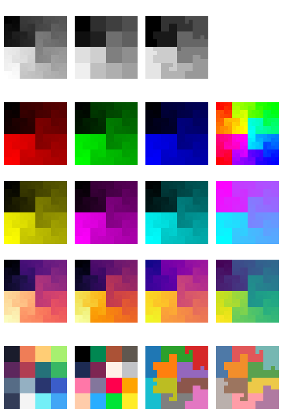

Matthew's plotting library (matthewplotlib)
===========================================

A Python plotting library that aspires to *not be painful.*

*Status:* Work in progress. See [roadmap](#roadmap-to-version-1). Currently,
still generally painful, due to lack of generated documentation and lack of
common plot types. However, for personal use, I'm already finding what limited
functionality it does have delightful.

Key features:

* Colourful unicode-based rendering of scatter plots, small images, heatmaps,
  bar charts, histograms, and more.

* Rendering plots to the terminal with `print(plot)` (no GUI windows to
  manage).

* Plots are just expressions. Compose complex plots with horizontal (`+`) and
  vertical (`/`) stacking operations, as in
    `subplots = (plotA + plotB) / (plotC + plotD)`.

* If you absolutely need plots outside the terminal, you can render them to PNG
  using a pixel font.

Key missing features (so far, see [roadmap](#roadmap)):

* Line plots still to be implemented.

* Plots don't have visible axes, ticks, ticklabels, or axis labels yet.

* No HTML documentation (but see WIP markdown [DOCS.md](DOCS.md)).

* Not a lot of input validation, error handling, or testing.

Some eye-candy:

<table>
<tbody>
  <tr>
    <td></td>
    <td></td>
    <td></td>
  </tr>
</tbody>
</table>

Quickstart
----------

Install:

```console
pip install git+https://github.com/matomatical/matthewplotlib.git
```

Import the library:

```python
import matthewplotlib as mp
```

Construct a plot:
```python
import numpy as np

xs = np.linspace(-2*np.pi, +2*np.pi, 156)
ys1 = 1.0 * np.cos(xs)
ys2 = 0.9 * np.cos(xs - 0.33 * np.pi)
ys3 = 0.8 * np.cos(xs - 0.66 * np.pi)
ys4 = 0.7 * np.cos(xs - 1.00 * np.pi)
ys5 = 0.8 * np.cos(xs - 1.33 * np.pi)
ys6 = 0.9 * np.cos(xs - 1.66 * np.pi)

plot = mp.border(
    mp.scatter(np.c_[xs, ys1], width=78, yrange=(-1,1), color=(1.,0.,0.))
    @ mp.scatter(np.c_[xs, ys2], width=78, yrange=(-1,1), color=(1.,0.,1.))
    @ mp.scatter(np.c_[xs, ys3], width=78, yrange=(-1,1), color=(0.,0.,1.))
    @ mp.scatter(np.c_[xs, ys4], width=78, yrange=(-1,1), color=(0.,1.,1.))
    @ mp.scatter(np.c_[xs, ys5], width=78, yrange=(-1,1), color=(0.,1.,0.))
    @ mp.scatter(np.c_[xs, ys6], width=78, yrange=(-1,1), color=(1.,1.,0.))
    | mp.center(mp.text(f"cos(x + 2 pi k / 6)"), width=78)
)
```

Print to terminal:
```python
print(plot)
```


Export to PNG image:
```python
plot.saveimg("images/quickstart.png")
```


Other examples
--------------

See [examples/](examples/) folder. Highlights:

* [lissajous.py](examples/lissajous.py) showing scatterplots and basic plot
  arrangement.

* [colormaps.py](examples/colormaps.py) showing off the different available
  colormaps more advanced plot arrangement.

* [calendar_heatmap.py](examples/calendar_heatmap.py) showing how to construct
  a custom plot, in this case colouring the cells of a calendar (inspired by
  GitHub issues tracker).

* [teapot.py](examples/teapot.py) showing how to use scatter plots to render a
  3d point cloud, and animations.

Ideas for future examples:

* Simple machine learning experiment, loss curves and progress bars.

* Simple gridworld rollout visualiser for reinforcement learning.

* CPU/RAM usage visualiser.


Roadmap to version 1
--------------------

Basic plot types:

* [x] Scatter plots.
* [x] Image plots / matrix heatmaps.
* [x] Function heatmap plots.
* [x] Progress bars.
* [x] Basic bar charts and column charts.
* [x] Histograms.
* [ ] Line plots.

Basic plot furnishings:

* [x] Basic text boxes.
* [x] Borders.
* [ ] Axis ticks and tick labels for scatter plots (API needs some thought).
* [ ] Labels and ticks for bar/column charts and histograms.

Basic plot arrangement:

* [x] Horizontal and vertical stacking.
* [x] Naive layering plots on top of each other.
* [x] Automatically wrapping plots into a grid.

Styling plots with colors:

* [x] Basic colormaps.
* [x] BIDS colormaps.
* [x] Rainbow colormap.
* [x] Cyberpunk colormap.
* [x] Discrete colour palettes.

Rendering:

* [x] Render to string / terminal with ANSI control codes.
* [x] Export to image with pixel font.

Basic code improvements:

* [x] Split up monolithic file into a small number of modules.
* [x] Comprehensive type annotations, static type checking with mypy.
* [ ] Robust input validation and error handling.
* [ ] Tests.

Documentation:

* [x] Minimal docstrings for everything user-facing.
* [x] Quick start guide.
* [x] Complete docstrings for modules, constants, etc.
* [x] Simple generated markdown documentation on GitHub.
* [ ] Simple generated HTML/CSS documentation, hosted on web.

Repository:

* [x] Set up project, installable via git.
* [x] A simple example for the quick-start guide.
* [x] Version numbering and changelog.
* [ ] List on PyPI.

Advanced features roadmap
-------------------------

More plot types:

* [ ] Scatter plots with different colours for each point.
* [ ] Less dense (non-braille) scatter plots with different markers?
* [ ] Multiple point clouds or lines on a single scatter/line plot.
* [ ] 3d scatter plots (see [teapot example](examples/teapot.py) for now).
* [x] Basic Hilbert curves.
* [ ] Non-square Hilbert curves.
* [ ] 3d Hilbert curves.
* [ ] Calendar heatmap plots (see calendar heatmap example for now).
* [ ] World maps, 2d projection.
* [ ] World maps, 3d globe.
* [ ] Candlestick plots.
* [ ] Error bars on line plots.
* [ ] Fill plots.
* [ ] Box plots.
* [ ] Bar/column charts with configurable sizes, spacing, alignment.
* [ ] Negative values in bar/column charts.

Advanced plot arrangement:

* [ ] Better support for animated plots (API needs thought).
* [ ] Cleaner way to share config/axes between multiple plots.

Advanced furnishings:

* [ ] Axis transformations (e.g. logarithmic scale).
* [ ] Legend construction (API needs thought).
* [ ] Color bars, vertical or horizontal.
* [ ] Text embedded in borders.

Advanced rendering:

* [ ] Export animations to gifs.
* [ ] Render plots to SVG (keep console aesthetic).
* [ ] Render plots to PDF (keep console aesthetic).

Back end improvements:

* [ ] Upgrade Char backend to use arrays of codepoints and colors (think
  PyTrees from JAX to replace the current nested lists of dataclasses).
* [ ] Vectorised composition operations.
* [ ] Vectorised bitmap rendering.
* [ ] Faster and more intelligent ANSI rendering (only include necessary
  control codes and resets, e.g., if several characters in a row use the same
  colours).
* [ ] Faster animated plot redraws (e.g., differential rendering with shortcut
  `-`).

More elaborate documentation:

* [ ] Tutorials and recipes.
* [ ] Freeze documentation with each version.
* [x] Links to source code from within documentation.
* [ ] Links to mentioned functions/classes/methods/types within documentation
  (automatically linked to relevant release).
* [ ] Documentation search.

Related work
------------

Matthewplotlib aspires to achieve a similar levels of functionality as covered
by the following projects.

Terminal plotting in Python:

* Plotext: https://github.com/piccolomo/plotext
* Plotille: https://github.com/tammoippen/plotille
* Termgraph: https://github.com/sgeisler/termgraph
* Termplot: https://github.com/justnoise/termplot

Terminal plotting in other languages:

* Julia https://github.com/JuliaPlots/UnicodePlots.jl
* Julia again https://github.com/sunetos/TextPlots.jl
* C++ https://github.com/fbbdev/plot
* GNU plot (dumb terminal mode) http://gnuplot.info/docs_6.0/loc19814.html

Braille art:

* Drawille (Python): https://github.com/asciimoo/drawille
* Rsille (Rust): https://github.com/nidhoggfgg/rsille
* Drawille (Lua): https://github.com/asciimoo/lua-drawille
* Drawille (NodeJS): https://github.com/madbence/node-drawille
* Python repo documents ports to various other languages

TODO: Checklist of specific interesting target features that are and are not
implemented.

## module matthewplotlib

[[source](https://github.com/matomatical/matthewplotlib/blob/main/matthewplotlib/__init__.py)]

Top-level module. Imports various documents items from other modules and makes
them available under the top-level namespace.

## module matthewplotlib.plots

[[source](https://github.com/matomatical/matthewplotlib/blob/main/matthewplotlib/plots.py)]

A collection of building blots for plotting. There are lots of options---take a
look through this module. They are roughly grouped as follows.

Base class:

* `plot`: Every plot object inherits from this one. See this class for methods,
  properties, and shortcut operators available with every plot object.

Data plots:

* `scatter`
* `function`
* `image`
* `function2`
* `histogram2`
* `progress`
* `bars`
* `histogram`
* `columns`
* `vistogram`
* `hilbert`

Furnishing plots:

* `text`
* `border`

Arrangement plots:

* `blank`
* `hstack`
* `vstack`
* `dstack`
* `wrap`
* `center`

### type matthewplotlib.plots.number

#### type number = int | float | np.integer | np.floating

[[source](https://github.com/matomatical/matthewplotlib/blob/main/matthewplotlib/plots.py#L55)]

### class matthewplotlib.plots.plot

[[source](https://github.com/matomatical/matthewplotlib/blob/main/matthewplotlib/plots.py#L62)]

Abstract base class for all plot objects.

A plot is essentially a 2D grid of `Char` objects. This class provides the
core functionality for rendering and composing plots. Not typically
instantiated directly, but it's useful to know its properties and methods.

Properties:

* height : int
    The height of the plot in character lines.
* width : int
    The width of the plot in character columns.

Methods:

* renderstr() -> str

    Returns a string representation of the plot with ANSI color codes,
    ready to be printed to a compatible terminal.

* clearstr() -> str

    Returns control characters that will clear the plot from the
    terminal after it has been printed.

* saveimg(filename: str)
    
    Renders the plot to an image file (e.g., "plot.png") using a
    pixel font.

Operators:

* `str(plot)`: Shortcut for `plot.renderstr()`. This means you can render
   the plot just by calling `print(plot)`.

* `-plot`: Shortcut for `plot.clearstr()`. Useful for animations.

* `plot1 + plot2`: Horizontally stacks plots (see `hstack`).

* `plot1 / plot2`: Vertically stacks plots (see `vstack`).

* `plot1 | plot2`: Vertically stacks plots (see `vstack`).

* `plot1 @ plot2`: Overlays plots (see `dstack`).

### method matthewplotlib.plots.plot.height

#### height() -> int

[[source](https://github.com/matomatical/matthewplotlib/blob/main/matthewplotlib/plots.py#L114)]

Number of character rows in the plot.

### method matthewplotlib.plots.plot.width

#### width() -> int

[[source](https://github.com/matomatical/matthewplotlib/blob/main/matthewplotlib/plots.py#L122)]

Number of character columns in the plot.

### method matthewplotlib.plots.plot.renderstr

#### renderstr() -> str

[[source](https://github.com/matomatical/matthewplotlib/blob/main/matthewplotlib/plots.py#L129)]

Convert the plot into a string for printing to the terminal.

Note: plot.renderstr() is equivalent to str(plot).

### method matthewplotlib.plots.plot.clearstr

#### clearstr(self: Self) -> str

[[source](https://github.com/matomatical/matthewplotlib/blob/main/matthewplotlib/plots.py#L138)]

Convert the plot into a string that, if printed immediately after
plot.renderstr(), will clear that plot from the terminal.

### method matthewplotlib.plots.plot.renderimg

#### renderimg(, scale\_factor: int) -> np.ndarray

[[source](https://github.com/matomatical/matthewplotlib/blob/main/matthewplotlib/plots.py#L146)]

Convert the plot into an RGBA array for rendering with Pillow.

### method matthewplotlib.plots.plot.saveimg

#### saveimg(, filename: str, scale\_factor: int)

[[source](https://github.com/matomatical/matthewplotlib/blob/main/matthewplotlib/plots.py#L172)]

Render the plot as an RGBA image and save it as a PNG file at the path
`filename`.

### method matthewplotlib.plots.plot.\_\_str\_\_

#### \_\_str\_\_() -> str

[[source](https://github.com/matomatical/matthewplotlib/blob/main/matthewplotlib/plots.py#L186)]

Shortcut for the string for printing the plot.

### method matthewplotlib.plots.plot.\_\_neg\_\_

#### \_\_neg\_\_(self: Self) -> str

[[source](https://github.com/matomatical/matthewplotlib/blob/main/matthewplotlib/plots.py#L193)]

Shortcut for the string for clearing the plot.

### method matthewplotlib.plots.plot.\_\_add\_\_

#### \_\_add\_\_(self: Self, other: Self) -> 'hstack'

[[source](https://github.com/matomatical/matthewplotlib/blob/main/matthewplotlib/plots.py#L200)]

Operator shortcut for horizontal stack.

```
plot1 + plot2 ==> hstack(plot1, plot2) ==> plot1 plot2
```

When combining with vertical stacking, note that `/` binds before `+`,
but `|` binds after:
```
plot1 / plot2 + plot3 / plot4
==> hstack(vstack(plot1, plot2), vstack(plot3, plot4))
==> plot1 plot3
    plot2 plot4

plot1 + plot2 | plot3 + plot4
==> vstack(hstack(plot1, plot2), hstack(plot3, plot4))
==> plot1 plot3
    plot2 plot4
```

### method matthewplotlib.plots.plot.\_\_truediv\_\_

#### \_\_truediv\_\_(self: Self, other: Self) -> 'vstack'

[[source](https://github.com/matomatical/matthewplotlib/blob/main/matthewplotlib/plots.py#L225)]

High-precedence operator shortcut for vertical stack.

```
plot1 / plot2 ==> vstack(plot1, plot2) ==> plot1
                                           plot2
```

When combining with horizontal stacking, note that `/` binds before
`+`:
```
plot1 / plot2 + plot3 / plot4
==> plot1 plot3
    plot2 plot4
```

For a version that binds after `+`, see `|`.

### method matthewplotlib.plots.plot.\_\_or\_\_

#### \_\_or\_\_(self: Self, other: Self) -> 'vstack'

[[source](https://github.com/matomatical/matthewplotlib/blob/main/matthewplotlib/plots.py#L247)]

Low-precedence operator shortcut for vertical stack.

```
plot1 | plot2 ==> vstack(plot1, plot2) ==> plot1
                                           plot2
```

When combining with horizontal stacking, note that `|` binds after `+`:
```
plot1 + plot2 | plot3 + plot4
==> plot1 plot3
    plot2 plot4
```

For a version that binds before `+`, see `/`.

### method matthewplotlib.plots.plot.\_\_matmul\_\_

#### \_\_matmul\_\_(self: Self, other: Self) -> 'dstack'

[[source](https://github.com/matomatical/matthewplotlib/blob/main/matthewplotlib/plots.py#L268)]

Operator shortcut for depth stack.

```
plot1_ @ plot_2 ==> dstack(plot1_, plot2_) => plot12
(where _ is a blank character)
```

Note that the precedence of `@` competes with `/`, so use parentheses
or pair with `|`.

### class matthewplotlib.plots.scatter

[[source](https://github.com/matomatical/matthewplotlib/blob/main/matthewplotlib/plots.py#L287)]

[Inherits from plot]

Render a scatterplot using a grid of braille unicode characters.

Each character cell in the plot corresponds to a 2x4 grid of sub-pixels,
represented by braille dots.

Inputs:

* data : number[n, 2]
    
    An array of n 2D points to plot. Each row is an (x, y) coordinate.

* width : int (default: 30)
    
    The width of the plot in characters. The effective pixel width will be
    2 * width.

* height : int (default: 10)
    
    The height of the plot in rows. The effective pixel height will be 4 *
    height.

* xrange : optional (number, number)
    
    The x-axis limits `(xmin, xmax)`. If not provided, the limits are
    inferred from the min and max x-values in the data.

* yrange : optional (number, number)
    
    The y-axis limits `(ymin, ymax)`. If not provided, the limits are
    inferred from the min and max y-values in the data.

* color : optional ColorLike
    
    The color of the plotted points (see `Color.parse`). Defaults to the
    terminal's default foreground color.

* check_bounds : bool (default: False)
    
    If True, raises a `ValueError` if any data points fall outside the
    specified `xrange` or `yrange`.

### method matthewplotlib.plots.scatter.\_\_repr\_\_

#### \_\_repr\_\_()

[[source](https://github.com/matomatical/matthewplotlib/blob/main/matthewplotlib/plots.py#L396)]

### class matthewplotlib.plots.function

[[source](https://github.com/matomatical/matthewplotlib/blob/main/matthewplotlib/plots.py#L405)]

[Inherits from scatter]

Scatter plot representing a particular function.

* F : float[batch] -> number[batch]
    
    The (vectorised) function to plot. The input should be a batch of
    floats x. The output should be a batch of scalars f(x).

* xrange : (float, float)
    
    Lower and upper bounds on the x values to pass into the function.

* width : int
    
    The number of character columns in the plot.

* height : int
    
    The number of character rows in the plot.

* yrange : optional (float, float)
    
    If provided, specifies the expected lower and upper bounds on the f(x)
    values. If not provided, they are automatically determined by using the
    minimum and maximum output over the inputs sampled.

* color : optional ColorLike

    If provided, sets the colors for the scattered points. By default,
    foreground color is used.

TODO:

* More intelligent interpolation, like a proper line plot with a given
  thickness.

### method matthewplotlib.plots.function.\_\_repr\_\_

#### \_\_repr\_\_()

[[source](https://github.com/matomatical/matthewplotlib/blob/main/matthewplotlib/plots.py#L470)]

### class matthewplotlib.plots.image

[[source](https://github.com/matomatical/matthewplotlib/blob/main/matthewplotlib/plots.py#L477)]

[Inherits from plot]

Render a small image or 2d array using a grid of unicode half-block
characters.

Represents an image by mapping pairs of vertically adjacent pixels to the
foreground and background colors of a single character cell (this
effectively doubles the vertical resolution in the terminal).

Inputs:

* im : float[h,w,3] | int[h,w,3] | float[h,w] | int[h,w] | ArrayLike

    The image data. It can be in any of the following formats:
    * `float[h,w,3]`: A 2D array of RGB triples of floats in range [0,1].
    * `int[h,w,3]`: A 2D array of RGB triples of ints in range [0,255].
    * `float[h,w]`: A 2D array of scalars in the range [0,1]. If no
      colormap is provided, values are treated as greyscale (uniform
      colorisation). If a continuous colormap is provided, values are
      mapped to RGB values.
    * `int[h,w]`: A 2D array of scalars. If no colormap is provided,
      values should be in the range [0,255], they are treated as greyscale
      (uniform colorisation). If a discrete colormap is provided, values
      should be in range as indices for the colormap, they will be mapped
      to RGB triples as such.
      
* colormap : optional ColorMap
    
    Function mapping (batches of) scalars to (batches of) RGB triples.
    Examples are provided by this library, such as:
    * continuous colormaps like `viridis : float[...] -> uint8[...,3]`, and
    * discrete colormaps like `pico8 : int[...] -> uint8[...,3]`.
    If `im` has no RGB dimension, it is transformed to a grid of RGB
    triples using one of these colormaps.

### method matthewplotlib.plots.image.\_\_repr\_\_

#### \_\_repr\_\_()

[[source](https://github.com/matomatical/matthewplotlib/blob/main/matthewplotlib/plots.py#L552)]

### class matthewplotlib.plots.function2

[[source](https://github.com/matomatical/matthewplotlib/blob/main/matthewplotlib/plots.py#L556)]

[Inherits from image]

Heatmap representing the image of a 2d function over a square.

Inputs:

* F : float[batch, 2] -> number[batch]
    
    The (vectorised) function to plot. The input should be a batch of
    (x, y) vectors. The output should be a batch of scalars f(x, y).

* xrange : (float, float)
    
    Lower and upper bounds on the x values to pass into the function.

* yrange : (float, float)
    
    Lower and upper bounds on the y values to pass into the function.

* width : int
    
    The number of character columns in the plot. This will also become the
    number of grid squares along the x axis.

* height : int
    
    The number of character rows in the plot. This will also be half of the
    number of grid squares, since the result is an image plot with two
    half-character-pixels per row.

* zrange : optional (float, float)
    
    Expected lower and upper bounds on the f(x, y) values. Used for
    determining the bounds of the colour scale. By default, the minimum and
    maximum output over the grid are used.

* colormap : optional colormap (e.g. mp.viridis)
    
    By default, the output will be in greyscale, with black corresponding
    to zrange[0] and white corresponding to zrange[1]. You can choose a
    different colormap (e.g. mp.reds, mp.viridis, etc.) here.

* endpoints : bool (default: False)
    
    If true, endpoints are included from the linspaced inputs, and so the
    grid elements in each corner will represent the different combinations
    of xrange/yrange.
    
    If false (default), the endpoints are excluded, so the lower bounds are
    met but the upper bounds are not, meaning each grid square color shows
    the value of the function precisely at its lower left corner.

### method matthewplotlib.plots.function2.\_\_repr\_\_

#### \_\_repr\_\_()

[[source](https://github.com/matomatical/matthewplotlib/blob/main/matthewplotlib/plots.py#L649)]

### class matthewplotlib.plots.histogram2

[[source](https://github.com/matomatical/matthewplotlib/blob/main/matthewplotlib/plots.py#L657)]

[Inherits from image]

Heatmap representing the density of a collection of 2d points.

Inputs:

* x : number[n]
    
    X coordinates of 2d points to bin and count.

* y : number[n]
    
    Y coordinates of 2d points to bin and count.

* width : int (default 24)

    Specifies the width of the plot in characters. This is also the number
    of bins in the x direction.

* height : int (default 12)
    
    Specifies the height of the plot in characters. This is also half the
    number of bins in the y direction.

* xrange : optional (number, number)
    
    The x-axis limits `(xmin, xmax)`. If not provided, the limits are
    inferred from the min and max x-values in the data.

* yrange : optional (number, number)
    
    The y-axis limits `(ymin, ymax)`. If not provided, the limits are
    inferred from the min and max y-values in the data.

* weights : optional number[n]

    If provided, each 2d point in data contributes this amount to the count
    for its bin (rather than the default 1). See np.histogram2d's weights
    argument for details.

* density : bool (default False)

    If true, normalise bin counts so that they sum to 1,0. See
    np.histogram2d's density argument for details.

* max_count : optional number

    If provided, cell colours are scaled so that only bars matching or
    exceeding this count max out the colour. Otherwise, the colours are
    scaled so that the bin with the highest count has the colour maxed out.

* colormap : optional colormap (e.g. mp.viridis)
    
    By default, the output will be in greyscale, with black corresponding
    to zero density and white corresponding to max_count. You can choose a
    different colormap (e.g. mp.reds, mp.viridis, etc.) here.

### method matthewplotlib.plots.histogram2.\_\_repr\_\_

#### \_\_repr\_\_()

[[source](https://github.com/matomatical/matthewplotlib/blob/main/matthewplotlib/plots.py#L770)]

### class matthewplotlib.plots.progress

[[source](https://github.com/matomatical/matthewplotlib/blob/main/matthewplotlib/plots.py#L779)]

[Inherits from plot]

A single-line progress bar.

Construct a progress bar with a percentage label. The bar is rendered using
Unicode block element characters to show fractional progress with finer
granularity.

Inputs:

* progress : float
    
    The progress to display, as a float between 0.0 and 1.0. Values outside
    this range will be clipped.

* width : int (default: 40)
    
    The total width of the progress bar plot in character columns,
    including the label and brackets.

* color : optional ColorLike
    
    The color of the filled portion of the progress bar. Defaults to the
    terminal's default foreground color.

### method matthewplotlib.plots.progress.\_\_repr\_\_

#### \_\_repr\_\_()

[[source](https://github.com/matomatical/matthewplotlib/blob/main/matthewplotlib/plots.py#L835)]

### class matthewplotlib.plots.bars

[[source](https://github.com/matomatical/matthewplotlib/blob/main/matthewplotlib/plots.py#L839)]

[Inherits from plot]

A multi-line bar chart.

Transform a list of values into horizontal bars with width indicating the
values. The bars are rendered using Unicode block element characters for
finer granularity.

Inputs:

* values : float[n]
    
    An array of non-negative values to display.

* width : int (default: 30)
    
    The total width of full bars.

* vrange : None | float | (float, float)
    
    Determine the scaling of the bars.
    * If omitted, the bars are scaled such that the bar(s) with the largest
      value occupy the whole width.
    * If a single number, then the bars are scaled so that bars with that
      value (or greater) would occupy the whole width.
    * If a pair of numbers, the bars are scaled so that bars with the first
      value (or less) would have zero width and bars with the second value
      (or greater) would occupy the whole width.

* color : optional ColorLike
    
    The color of the filled portion of the bars. Defaults to the terminal's
    default foreground color.

TODO:

* Make it possible to draw bars to the left for values below 0.
* Make it possible to align all bars to the right rather than left.
* Allow each bar to have a height other than 1, and allow spacing.

### method matthewplotlib.plots.bars.\_\_repr\_\_

#### \_\_repr\_\_()

[[source](https://github.com/matomatical/matthewplotlib/blob/main/matthewplotlib/plots.py#L915)]

### class matthewplotlib.plots.histogram

[[source](https://github.com/matomatical/matthewplotlib/blob/main/matthewplotlib/plots.py#L923)]

[Inherits from bars]

A histogram bar chart.

Transform a sequence of values into horizontal bars representing the
density in different bins. The bars are rendered using Unicode block
element characters for finer granularity.

Inputs:

* data : number[n]
    
    An array of values to count.

* xrange : optional (number, number)

    If provided, bins range over this interval, and values outside the
    range are discarded. Same as np.histogram's range argument.

* bins : optional int, sequence, or str

    If provided, used to determine number of bins, bin boundaries, or bin
    boundary determination method. See np.histogram's bins argument for
    details.

* weights : optional number[n]

    If provided, each element in data contributes this amount to the count
    for its bin (rather than the default 1). See np.histogram's weights
    argument for details.

* density : bool (default False)

    If true, normalise bin counts so that they sum to 1,0. See
    np.histogram's density argument for details.

* max_count : optional number

    If provided, the bars are scaled so that only bars matching or
    exceeding this count are full. Otherwise, the bars are scaled so that
    the bin with the highest count has a full bar.

* width : int (default: 22)
    
    The total width of full bars.

* color : optional ColorLike
    
    The color of the filled portion of the bars. Defaults to the terminal's
    default foreground color.

### method matthewplotlib.plots.histogram.\_\_repr\_\_

#### \_\_repr\_\_()

[[source](https://github.com/matomatical/matthewplotlib/blob/main/matthewplotlib/plots.py#L1008)]

### class matthewplotlib.plots.columns

[[source](https://github.com/matomatical/matthewplotlib/blob/main/matthewplotlib/plots.py#L1016)]

[Inherits from plot]

A column chart.

Transform a list of values into vertical columns with height indicating the
values. The columns are rendered using Unicode block element characters for
finer granularity.

Inputs:

* values : number[n]
    
    An array of non-negative values to display.

* height : int (default: 10)
    
    The total width of full columns.

* vrange : None | number | (number, number)
    
    Determine the scaling of the columns.
    * If omitted, the columns are scaled such that the columns(s) with the
      largest value occupy the whole width.
    * If a single number, then the columns are scaled so that columns with
      that value (or greater) would occupy the whole width.
    * If a pair of numbers, the columns are scaled so that columns with the
      first value (or less) would have zero width and columns with the
      second value (or greater) would occupy the whole width.

* color : optional ColorLike
    
    The color of the filled portion of the columns. Defaults to the
    terminal's default foreground color.

TODO:

* Make it possible to draw columns downward for values below 0.
* Make it possible to align all columns to the top rather than bottom.
* Allow each column to have a height other than 1, and allow spacing.

### method matthewplotlib.plots.columns.\_\_repr\_\_

#### \_\_repr\_\_()

[[source](https://github.com/matomatical/matthewplotlib/blob/main/matthewplotlib/plots.py#L1094)]

### class matthewplotlib.plots.vistogram

[[source](https://github.com/matomatical/matthewplotlib/blob/main/matthewplotlib/plots.py#L1102)]

[Inherits from columns]

A histogram column chart ("vertical histogram", referring to the direction
of the bars rather than the bins).

Transform a sequence of values into columns representing the density in
different bins. The columns are rendered using Unicode block element
characters for finer granularity.

Inputs:

* data : number[n]
    
    An array of values to count.

* xrange : optional (number, number)

    If provided, bins range over this interval, and values outside the
    range are discarded. Same as np.histogram's range argument.

* bins : optional int, sequence, or str

    If provided, used to determine number of bins, bin boundaries, or bin
    boundary determination method. See np.histogram's bins argument for
    details.

* weights : optional number[n]

    If provided, each element in data contributes this amount to the count
    for its bin (rather than the default 1). See np.histogram's weights
    argument for details.

* density : bool (default False)

    If true, normalise bin counts so that they sum to 1,0. See
    np.histogram's density argument for details.

* max_count : optional number

    If provided, the bars are scaled so that only bars matching or
    exceeding this count are full. Otherwise, the bars are scaled so that
    the bin with the highest count has a full bar.

* height : int (default: 22)
    
    The total height of full bars.

* color : optional ColorLike
    
    The color of the filled portion of the bars. Defaults to the terminal's
    default foreground color.

### method matthewplotlib.plots.vistogram.\_\_repr\_\_

#### \_\_repr\_\_()

[[source](https://github.com/matomatical/matthewplotlib/blob/main/matthewplotlib/plots.py#L1188)]

### class matthewplotlib.plots.hilbert

[[source](https://github.com/matomatical/matthewplotlib/blob/main/matthewplotlib/plots.py#L1196)]

[Inherits from plot]

Visualize a 1D boolean array along a 2D Hilbert curve.

Maps a 1D sequence of data points to a 2D grid using a space-filling
Hilbert curve, which helps preserve locality. The curve is rendered using
braille unicode characters for increased resolution.

Inputs:

* data : bool[N]
    
    A 1D array of booleans. The length `N` determines the order of the
    Hilbert curve required to fit all points. True values are rendered as
    dots, and False values are rendered as blank spaces.

* dotcolor : optional ColorLike
    
    The foreground color used for dots (points along the curve where `data`
    is `True`). Defaults to the terminal's default foreground color.

* bgcolor : optional ColorLike
    
    The background color for the entire path of the Hilbert curve (points
    along the curve where `data` is `False`, plus possibly some extra
    points if the curve does not exactly fit the last character cell).
    Defaults to a transparent background.

* nullcolor : optional ColorLike
    
    The background color for the grid area not occupied by the curve. This
    is relevant for non-square-power-of-2 data lengths. Defaults to a
    transparent background.

### method matthewplotlib.plots.hilbert.\_\_repr\_\_

#### \_\_repr\_\_()

[[source](https://github.com/matomatical/matthewplotlib/blob/main/matthewplotlib/plots.py#L1280)]

### class matthewplotlib.plots.text

[[source](https://github.com/matomatical/matthewplotlib/blob/main/matthewplotlib/plots.py#L1292)]

[Inherits from plot]

    A plot object containing one or more lines of text.

    This class wraps a string in the plot interface, allowing it to be
    composed with other plot objects. It handles multi-line strings by
    splitting them at newline characters.

    Inputs:

    * text : str
        
        The text to be displayed. Newline characters (`
`) will create
        separate lines in the plot.
    
    * color : optional ColorLike
        
        The foreground color of the text. Defaults to the terminal's default
        foreground color.
    
    * bgcolor : optional ColorLike
        
        The background color for the text. Defaults to a transparent
        background.
    
    TODO:

    * Allow alignment and resizing.
    
    * Account for non-printable and wide characters.
    

### method matthewplotlib.plots.text.\_\_repr\_\_

#### \_\_repr\_\_()

[[source](https://github.com/matomatical/matthewplotlib/blob/main/matthewplotlib/plots.py#L1346)]

### class matthewplotlib.plots.border

[[source](https://github.com/matomatical/matthewplotlib/blob/main/matthewplotlib/plots.py#L1353)]

[Inherits from plot]

Add a border around a plot using box-drawing characters.

Inputs:

* plot : plot
    
    The plot object to be enclosed by the border.

* style : BoxStyle (default: BoxStyle.ROUND)
    
    The style of the border. Predefined styles are available in `BoxStyle`.

* color : optional ColorLike
    
    The color of the border characters. Defaults to the terminal's
    default foreground color.

### method matthewplotlib.plots.border.\_\_repr\_\_

#### \_\_repr\_\_()

[[source](https://github.com/matomatical/matthewplotlib/blob/main/matthewplotlib/plots.py#L1408)]

### class matthewplotlib.plots.blank

[[source](https://github.com/matomatical/matthewplotlib/blob/main/matthewplotlib/plots.py#L1416)]

[Inherits from plot]

Creates a rectangular plot composed entirely of blank space.

Useful for adding padding or aligning items in a complex layout.

Inputs:

* height : optional int

  The height of the blank area in character rows. Default 1.

* width : optional int

  The width of the blank area in character columns. Default 1.

### method matthewplotlib.plots.blank.\_\_repr\_\_

#### \_\_repr\_\_()

[[source](https://github.com/matomatical/matthewplotlib/blob/main/matthewplotlib/plots.py#L1441)]

### class matthewplotlib.plots.hstack

[[source](https://github.com/matomatical/matthewplotlib/blob/main/matthewplotlib/plots.py#L1445)]

[Inherits from plot]

Horizontally arrange one or more plots side-by-side.

If the plots have different heights, the shorter plots will be padded with
blank space at the bottom to match the height of the tallest plot.

Inputs:

* *plots : plot
    
    A sequence of plot objects to be horizontally stacked.

### method matthewplotlib.plots.hstack.\_\_repr\_\_

#### \_\_repr\_\_()

[[source](https://github.com/matomatical/matthewplotlib/blob/main/matthewplotlib/plots.py#L1474)]

### class matthewplotlib.plots.vstack

[[source](https://github.com/matomatical/matthewplotlib/blob/main/matthewplotlib/plots.py#L1481)]

[Inherits from plot]

Vertically arrange one or more plots, one above the other.

If the plots have different widths, the narrower plots will be padded with
blank space on the right to match the width of the widest plot.

Inputs:

* *plots : plot
    
    A sequence of plot objects to be vertically stacked.

### method matthewplotlib.plots.vstack.\_\_repr\_\_

#### \_\_repr\_\_()

[[source](https://github.com/matomatical/matthewplotlib/blob/main/matthewplotlib/plots.py#L1508)]

### class matthewplotlib.plots.dstack

[[source](https://github.com/matomatical/matthewplotlib/blob/main/matthewplotlib/plots.py#L1515)]

[Inherits from plot]

Overlay one or more plots on top of each other.

The plots are layered in the order they are given, with later plots in the
sequence drawn on top of earlier ones. The final size of the plot is
determined by the maximum width and height among all input plots. Non-blank
characters from upper layers will obscure characters from lower layers.

Inputs:

* *plots : plot
    
    A sequence of plot objects to be overlaid.

### method matthewplotlib.plots.dstack.\_\_repr\_\_

#### \_\_repr\_\_()

[[source](https://github.com/matomatical/matthewplotlib/blob/main/matthewplotlib/plots.py#L1554)]

### class matthewplotlib.plots.wrap

[[source](https://github.com/matomatical/matthewplotlib/blob/main/matthewplotlib/plots.py#L1561)]

[Inherits from plot]

Arrange a sequence of plots into a grid.

The plots are arranged from left to right, wrapping to a new line when
the specified number of columns is reached. All cells in the grid are
padded to the size of the largest plot in the sequence.

Inputs:

* *plots : plot
    
    A sequence of plot objects to be arranged in a grid.

* cols : optional int
    
    The number of columns in the grid. If not provided, it is automatically
    determined based on the terminal width and the width of the largest
    plot.

### method matthewplotlib.plots.wrap.\_\_repr\_\_

#### \_\_repr\_\_()

[[source](https://github.com/matomatical/matthewplotlib/blob/main/matthewplotlib/plots.py#L1616)]

### class matthewplotlib.plots.center

[[source](https://github.com/matomatical/matthewplotlib/blob/main/matthewplotlib/plots.py#L1623)]

[Inherits from plot]

Pad a plot with blank space to center it within a larger area.

If the specified `height` or `width` is smaller than the plot's dimensions,
the larger dimension is used, effectively preventing the plot from being
cropped.

Inputs:

* plot : plot

    The plot object to be centered.

* height : optional int
    
    The target height of the new padded plot. If not provided, it defaults
    to the original plot's height (no vertical padding).

* width : optional int
    
    The target width of the new padded plot. If not provided, it defaults
    to the original plot's width (no horizontal padding).

### method matthewplotlib.plots.center.\_\_repr\_\_

#### \_\_repr\_\_()

[[source](https://github.com/matomatical/matthewplotlib/blob/main/matthewplotlib/plots.py#L1672)]

## module matthewplotlib.colors

[[source](https://github.com/matomatical/matthewplotlib/blob/main/matthewplotlib/colors.py)]

Configuring various plots involves specifying colours. In most cases, colours
can be specified in one of the following `ColorLike` formats:

1. **Named colours:** The following strings are recognised and translated to
   RGB triples: `"black"`, `"red"`, `"green"`, `"blue"`, `"cyan"`, `"magenta"`,
   `"yellow"`, `"white"`.

2. **Hexadecimal:** A hexadecimal string like ``"#ff0000"`` specifying the RGB
   values in the usual manner.

3. **Short hexadecimal:** A three-character hexadecimal string like `"#f00"`,
   where `"#RGB"` is equivalent to `"#RRGGBB"` in the usual hexadecimal format.

4. **Integer triple:** An array or tuple of three integers in the range 0 to
    255, converted directly to an RGB triple.

5. **Float triple:** An array or tuple of three floats in the range 0.0 to 1.0,
   converted to an RGB triple by multiplying by 255 and rounding down to the
   nearest integer.
   
   (Arrays or tuples with mixed integers and floats are promoted by NumPy to
   become float triples.)

The `Color` class is used internally to represent an RGB colour that has been
parsed from one of the above formats. In most cases, it is not used externally.

In some contexts, colours are specified through a colour map rather than
directly specified---see the `matthewplotlib.colormaps` module for details.

### type matthewplotlib.colors.ColorLike

#### type ColorLike = str | np.ndarray | tuple[int, int, int] | tuple[float, float, float]

[[source](https://github.com/matomatical/matthewplotlib/blob/main/matthewplotlib/colors.py#L38)]

### class matthewplotlib.colors.Color

[[source](https://github.com/matomatical/matthewplotlib/blob/main/matthewplotlib/colors.py#L46)]

An RGB color triple.

### method matthewplotlib.colors.Color.\_\_iter\_\_

#### \_\_iter\_\_() -> Iterator[int]

[[source](https://github.com/matomatical/matthewplotlib/blob/main/matthewplotlib/colors.py#L55)]

### method matthewplotlib.colors.Color.parse

#### parse(color: ColorLike | None) -> Color | None

[[source](https://github.com/matomatical/matthewplotlib/blob/main/matthewplotlib/colors.py#L60)]

Accept and standardise RGB triples in various formats. See module-level
documentation for a description of the possible formats.

## module matthewplotlib.colormaps

[[source](https://github.com/matomatical/matthewplotlib/blob/main/matthewplotlib/colormaps.py)]

A collection of pre-defined colormaps. They generally come in two flavours:

* Continuous colormaps: Functions of type `float[...] -> uint8[..., 3]`. They
  turn a batch of floats in the range [0.0, 1.0] into a batch of RGB triples.
* Discrete colormaps: Functions of type `int[...] -> uint8[..., 3]`. They turn
  a batch of integer indices into a batch of RGB triples by indexing into the
  color palette.

For example:


### type matthewplotlib.colormaps.ContinuousColorMap

#### type ContinuousColorMap = Callable[[ArrayLike], np.ndarray]

[[source](https://github.com/matomatical/matthewplotlib/blob/main/matthewplotlib/colormaps.py#L25)]

### type matthewplotlib.colormaps.DiscreteColorMap

#### type DiscreteColorMap = Callable[[ArrayLike], np.ndarray]

[[source](https://github.com/matomatical/matthewplotlib/blob/main/matthewplotlib/colormaps.py#L31)]

### type matthewplotlib.colormaps.ColorMap

#### type ColorMap = ContinuousColorMap | DiscreteColorMap

[[source](https://github.com/matomatical/matthewplotlib/blob/main/matthewplotlib/colormaps.py#L37)]

### function matthewplotlib.colormaps.reds

#### reds(x: ArrayLike) -> np.ndarray

[[source](https://github.com/matomatical/matthewplotlib/blob/main/matthewplotlib/colormaps.py#L44)]

Red colormap. Simply embeds greyscale value into red channel.

### function matthewplotlib.colormaps.greens

#### greens(x: ArrayLike) -> np.ndarray

[[source](https://github.com/matomatical/matthewplotlib/blob/main/matthewplotlib/colormaps.py#L56)]

Green colormap. Simply embeds greyscale value into green channel.

### function matthewplotlib.colormaps.blues

#### blues(x: ArrayLike) -> np.ndarray

[[source](https://github.com/matomatical/matthewplotlib/blob/main/matthewplotlib/colormaps.py#L68)]

Blue colormap. Simply embeds greyscale value into blue channel.

### function matthewplotlib.colormaps.yellows

#### yellows(x: ArrayLike) -> np.ndarray

[[source](https://github.com/matomatical/matthewplotlib/blob/main/matthewplotlib/colormaps.py#L80)]

Yellow colormap. Simply embeds greyscale value into red and green channels.

### function matthewplotlib.colormaps.magentas

#### magentas(x: ArrayLike) -> np.ndarray

[[source](https://github.com/matomatical/matthewplotlib/blob/main/matthewplotlib/colormaps.py#L93)]

Magenta colormap. Simply embeds greyscale value into red and blue
channels.

### function matthewplotlib.colormaps.cyans

#### cyans(x: ArrayLike) -> np.ndarray

[[source](https://github.com/matomatical/matthewplotlib/blob/main/matthewplotlib/colormaps.py#L107)]

Cyan colormap. Simply embeds greyscale value into green and blue
channels.

### function matthewplotlib.colormaps.cyber

#### cyber(x: ArrayLike) -> np.ndarray

[[source](https://github.com/matomatical/matthewplotlib/blob/main/matthewplotlib/colormaps.py#L125)]

Cyberpunk colormap. Uses greyscale value to interpolate between meganta
(0.) and cyan (1.).

### function matthewplotlib.colormaps.rainbow

#### rainbow(x: ArrayLike) -> np.ndarray

[[source](https://github.com/matomatical/matthewplotlib/blob/main/matthewplotlib/colormaps.py#L140)]

Rainbow colormap. Effectively embeds greyscale values as hue in HSV color
space.

### function matthewplotlib.colormaps.magma

#### magma(x: ArrayLike) -> np.ndarray

[[source](https://github.com/matomatical/matthewplotlib/blob/main/matthewplotlib/colormaps.py#L188)]

Magma colormap by Nathaniel J. Smith and Stefan van der Walt (see
https://bids.github.io/colormap/).

Discretised to 256 8-bit colours.

### function matthewplotlib.colormaps.inferno

#### inferno(x: ArrayLike) -> np.ndarray

[[source](https://github.com/matomatical/matthewplotlib/blob/main/matthewplotlib/colormaps.py#L266)]

Inferno colormap by Nathaniel J. Smith and Stefan van der Walt (see
https://bids.github.io/colormap/).

Discretised to 256 8-bit colours.

### function matthewplotlib.colormaps.plasma

#### plasma(x: ArrayLike) -> np.ndarray

[[source](https://github.com/matomatical/matthewplotlib/blob/main/matthewplotlib/colormaps.py#L344)]

Plasma colormap by Nathaniel J. Smith and Stefan van der Walt (see
https://bids.github.io/colormap/).

Discretised to 256 8-bit colours.

### function matthewplotlib.colormaps.viridis

#### viridis(x: ArrayLike) -> np.ndarray

[[source](https://github.com/matomatical/matthewplotlib/blob/main/matthewplotlib/colormaps.py#L422)]

Viridis colormap by Nathaniel J. Smith, Stefan van der Walt, and Eric
Firing (see https://bids.github.io/colormap/).

Discretised to 256 8-bit colours.

### function matthewplotlib.colormaps.sweetie16

#### sweetie16(x: ArrayLike) -> np.ndarray

[[source](https://github.com/matomatical/matthewplotlib/blob/main/matthewplotlib/colormaps.py#L504)]

Sweetie-16 colour palette by GrafxKid (see
https://lospec.com/palette-list/sweetie-16).

Input should be an array of indices in the range [0,15] (or else it will
cycle).

### function matthewplotlib.colormaps.pico8

#### pico8(x: ArrayLike) -> np.ndarray

[[source](https://github.com/matomatical/matthewplotlib/blob/main/matthewplotlib/colormaps.py#L523)]

PICO-8 colour palette (see https://pico-8.fandom.com/wiki/Palette).

Input should be an array of indices in the range [0,15] (or else it will
cycle).

### function matthewplotlib.colormaps.tableau

#### tableau(x: ArrayLike) -> np.ndarray

[[source](https://github.com/matomatical/matthewplotlib/blob/main/matthewplotlib/colormaps.py#L541)]

Matplotlib Tableau colourmap.

Input should be an array of indices in the range [0,9] (or else it will
cycle).

### function matthewplotlib.colormaps.nouveau

#### nouveau(x: ArrayLike) -> np.ndarray

[[source](https://github.com/matomatical/matthewplotlib/blob/main/matthewplotlib/colormaps.py#L558)]

Updated Tableau colourmap (more accessible).

Input should be an array of indices in the range [0,9] (or else it will
cycle).

## module matthewplotlib.core

[[source](https://github.com/matomatical/matthewplotlib/blob/main/matthewplotlib/core.py)]

A collection of classes and types used internally.

Constants:

* `BLANK : Char`

    A colourless space character used for padding.

### class matthewplotlib.core.Char

[[source](https://github.com/matomatical/matthewplotlib/blob/main/matthewplotlib/core.py#L27)]

A single possibly-coloured character. Plots are assembled from characters
like these.

### method matthewplotlib.core.Char.isblank

#### isblank(self: Self) -> bool

[[source](https://github.com/matomatical/matthewplotlib/blob/main/matthewplotlib/core.py#L37)]

True if the character has no visible content.

### method matthewplotlib.core.Char.bg\_

#### bg\_(self: Self) -> Color | None

[[source](https://github.com/matomatical/matthewplotlib/blob/main/matthewplotlib/core.py#L45)]

The 'effective' background color of this Char.

Usually, this is just the background color, except in the special case
where c happens to be '█', in which case return the foreground color.

### method matthewplotlib.core.Char.to\_ansi\_str

#### to\_ansi\_str(self: Self) -> str

[[source](https://github.com/matomatical/matthewplotlib/blob/main/matthewplotlib/core.py#L58)]

If necessary, wrap a Char in ANSI control codes that switch the color into
the given fg and bg colors; plus a control code to switch back to default
mode.

### method matthewplotlib.core.Char.to\_rgba\_array

#### to\_rgba\_array(self: Self) -> np.ndarray

[[source](https://github.com/matomatical/matthewplotlib/blob/main/matthewplotlib/core.py#L75)]

Convert a Char to a small RGBA image patch, with the specified foreground
color (or white) and background color (or a transparent background).

### function matthewplotlib.core.braille\_encode

#### braille\_encode(a: ArrayLike) -> np.ndarray

[[source](https://github.com/matomatical/matthewplotlib/blob/main/matthewplotlib/core.py#L117)]

Turns a HxW array of booleans into a (H//4)x(W//2) array of braille
binary codes.

Inputs:

* a: bool[4h, 2w]
    
    Array of booleans, height divisible by 4 and width divisible by 2.

Returns:

* bits: uint16[h, w]

    An array of braille unicode code points. The unicode characters will
    have a dot in the corresponding places where `a` is True.

An illustrated example is as follows:
```
Start with an array with height divisible by 4, width divisible by 2:
    ____
   [1  0] 0  1  0  1  1  1  1  0  1  0  0  0  0  1  0  0  0  0  0  1  1  0
   [1  0] 0  1  0  1  0  0  0  0  1  0  0  0  0  1  0  0  0  0  1  0  0  1
 .-[1  0] 0  1  0  1  0  0  0  0  1  0  0  0  0  1  0  0  0  0  1  0  0  1
 | [1__0] 0  1  0  1  0  0  0  0  1  0  0  0  0  1  0  0  0  0  1  0  0  1
 |  1  1  1  1  0  1  1  1  1  0  1  0  0  0  0  1  0  0  0  0  1  0  0  1
 |  1  0  0  1  0  1  0  0  0  0  1  0  0  0  0  1  0  0  0  0  1  0  0  1
 |  1  0  0  1  0  1  0  0  0  0  1  0  0  0  0  1  0  0  0  0  1  0  0  1
 |  1  0  0  1  0  1  1  1  1  0  1  1  1  1  0  1  1  1  1  0  0  1  1  0
 |
 | take each 4x2 subarray and ...
 |                                                               braille
 | identify the 4x2 bits with the                                unicode
 | eight numbered braille dots:                                  start pt
 |                                                               |
 |  (dot 1) 1 0 (dot 4)     convert to                           v
 `> (dot 2) 1 0 (dot 5) -----------------> 0 b 0 1 0 0 0 1 1 1 + 0x2800 -.
    (dot 3) 1 0 (dot 6)    braille code        | | | | | | | |           |
    (dot 7) 1 0 (dot 8)                    dot 8 7 6 5 4 3 2 1           |
                                                                         |
  convert the braille code to a unicode character and collate into array |
 .-----------------------------------------------------------------------'
 |  '''
 `->⡇⢸⢸⠉⠁⡇⠀⢸⠀⠀⡎⢱  (Note: this function returns codepoints, use `chr()`
    ⡏⢹⢸⣉⡁⣇⣀⢸⣀⡀⢇⡸  to convert these into braille characters for printing.)
    '''
```

### function matthewplotlib.core.unicode\_bar

#### unicode\_bar(proportion: float, total\_width: int) -> list[str]

[[source](https://github.com/matomatical/matthewplotlib/blob/main/matthewplotlib/core.py#L192)]

Generates a Unicode progress bar as a list of characters.

This function creates a fixed-width left-to-right bar using Unicode block
elements to represent the proportion rounded down to nearest 1/8th of a
block.

Inputs:

* proportion: float

    The fraction of the bar to fill. Should be between 0.0 and 1.0
    inclusive.

* total_width: int
    
    The width of the full bar in characters. Should be positive.

Returns:

* bar: list[str]

    A list of unicode characters representing the bar. The length of the
    list is always equal to `total_width`.

Examples:

```
>>> ''.join(unicode_bar(0.5, 10))
'█████     '
>>> ''.join(unicode_bar(0.625, 10))
'██████▎   '

```

### function matthewplotlib.core.unicode\_col

#### unicode\_col(proportion: float, total\_height: int) -> list[str]

[[source](https://github.com/matomatical/matthewplotlib/blob/main/matthewplotlib/core.py#L251)]

Generates a Unicode progress column as a list of characters.

This function creates a fixed-height column using Unicode block elements to
represent a proportion rounded down to nearest 1/8th of a block. The list
goes from the top of the bar to the bottom, but the bar grows from the
bottom towards the top.

Inputs:

* proportion: float

    The fraction of the column to fill. Should be between 0.0 and 1.0
    inclusive.

* total_height: int
    
    The height of the full bar in characters. Should be positive.

Returns:

* bar: list[str]

    A list of unicode characters representing the bar. The length of the
    list is always equal to `total_height`.

Examples:

```
>>> unicode_col(0.5, 3)
[' ','▄','█']

```

### class matthewplotlib.core.BoxStyle

[[source](https://github.com/matomatical/matthewplotlib/blob/main/matthewplotlib/core.py#L311)]

[Inherits from str, enum.Enum]

A string enum defining preset styles for the `border` plot.

Each style is a string of six characters representing the border
elements in the following order: horizontal, vertical, top-left,
top-right, bottom-left, and bottom-right.

Available Styles:

* `LIGHT`:  A standard, single-line border.
* `HEAVY`:  A thicker, bold border.
* `DOUBLE`: A double-line border.
* `DASHED`: A dashed single-line border.
* `BLANK`:  An invisible border (easily add 1-width padding).
* `ROUND`:  A single-line border with rounded corners.
* `BUMPER`: A single-line border with corners made of blocks.
* `BLOCK1`: A blocky border with half-width left and right walls.
* `BLOCK2`: A uniform blocky border.
* `TIGER1`: A stripy block border.
* `TIGER2`: An alternative stripy block border.

Demo:

```
┌──────┐ ┏━━━━━━┓ ╔══════╗ ┌╌╌╌╌╌╌┐ ⡤⠤⠤⠤⠤⠤⠤⢤ ╭──────╮
│LIGHT │ ┃HEAVY ┃ ║DOUBLE║ ┊DASHED┊ ⡇DOTTED⢸ │ROUND │
└──────┘ ┗━━━━━━┛ ╚══════╝ └╌╌╌╌╌╌┘ ⠓⠒⠒⠒⠒⠒⠒⠚ ╰──────╯
         ▛──────▜ ▛▀▀▀▀▀▀▜ █▀▀▀▀▀▀█ ▞▝▝▝▝▝▝▝ ▘▘▘▘▘▘▘▚
 BLANK   │BUMPER│ ▌BLOCK1▐ █BLOCK2█ ▖TIGER1▝ ▘TIGER2▗
         ▙──────▟ ▙▄▄▄▄▄▄▟ █▄▄▄▄▄▄█ ▖▖▖▖▖▖▖▞ ▚▗▗▗▗▗▗▗
```

TODO:

* It might make sense to consider borders with two characters on the left
  and right sides of the contents. Would open up new design possibilities.

### method matthewplotlib.core.BoxStyle.nw

#### nw() -> str

[[source](https://github.com/matomatical/matthewplotlib/blob/main/matthewplotlib/core.py#L364)]

Northwest corner symbol.

### method matthewplotlib.core.BoxStyle.n

#### n() -> str

[[source](https://github.com/matomatical/matthewplotlib/blob/main/matthewplotlib/core.py#L370)]

North edge symbol.

### method matthewplotlib.core.BoxStyle.ne

#### ne() -> str

[[source](https://github.com/matomatical/matthewplotlib/blob/main/matthewplotlib/core.py#L376)]

Norteast corner symbol.

### method matthewplotlib.core.BoxStyle.e

#### e() -> str

[[source](https://github.com/matomatical/matthewplotlib/blob/main/matthewplotlib/core.py#L382)]

East edge symbol.

### method matthewplotlib.core.BoxStyle.w

#### w() -> str

[[source](https://github.com/matomatical/matthewplotlib/blob/main/matthewplotlib/core.py#L388)]

West edge symbol.

### method matthewplotlib.core.BoxStyle.sw

#### sw() -> str

[[source](https://github.com/matomatical/matthewplotlib/blob/main/matthewplotlib/core.py#L394)]

Southwest corner symbol.

### method matthewplotlib.core.BoxStyle.s

#### s() -> str

[[source](https://github.com/matomatical/matthewplotlib/blob/main/matthewplotlib/core.py#L400)]

South edge symbol.

### method matthewplotlib.core.BoxStyle.se

#### se() -> str

[[source](https://github.com/matomatical/matthewplotlib/blob/main/matthewplotlib/core.py#L406)]

Southeast corner symbol.

## module matthewplotlib.unscii16

[[source](https://github.com/matomatical/matthewplotlib/blob/main/matthewplotlib/unscii16.py)]

Unscii 2.0, bitmap unicode font created by Viznut (http://viznut.fi/unscii/).

This module is a port of all non-wide characters from unscii-16 (16px by 8px).

### function matthewplotlib.unscii16.bitmap

#### bitmap(char: str) -> np.ndarray

[[source](https://github.com/matomatical/matthewplotlib/blob/main/matthewplotlib/unscii16.py#L11)]

Look up the bitmap for a single character.

Inputs:

* char: str (len 1)
    A single-character string.

Returns:

* bits: bool[16, 8]
    A boolean array representing the character's bitmap.

