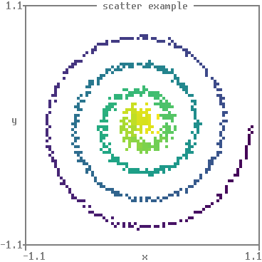
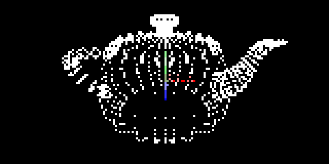

Matthew's plotting library (matthewplotlib)
===========================================

A Python plotting library that aspires to *not be painful.*

*Status:* Work in progress. See [roadmap](#roadmap-to-version-1). Currently,
still generally painful, due to lack of generated documentation and lack of
common plot types. However, for personal use, I'm already finding what limited
functionality it does have delightful.

<table><tr>
  <td width="30%">
    
    
  </td>
  <td width="40%">
    
    
  </td>
  <td width="30%">
    
    
  </td>
</tr></table>

Key features:

* Colourful unicode-based rendering of scatter plots, small images, heatmaps,
  bar charts, histograms, 3d plots, and more.
* Rendering plots to the terminal with `print(plot)`. No GUI windows to manage!
* Plots are just expressions. Compose complex plots with horizontal (`+`) and
  vertical (`/`) stacking operations, as in
    `subplots = (plotA + plotB) / (plotC + plotD)`.
* If you absolutely need plots outside the terminal, you can render them to PNG
  using a pixel font.

Rough edges:

* API for compositions not final.
* API for axes not final.
* No labels available for bars/columns/histograms yet.
* No HTML documentation (but see WIP markdown [DOCS.md](DOCS.md)).
* Limited input validation, error handling, or testing.


Quickstart
----------

Install:

```console
pip install git+https://github.com/matomatical/matthewplotlib.git
```

Import the library:

```python
import matthewplotlib as mp
```

Construct a plot:
```python
import numpy as np

xs = np.linspace(-2*np.pi, +2*np.pi, 156)

plot = mp.axes(
    mp.scatter(
        (xs, 1.0 * np.cos(xs), "red"),
        (xs, 0.9 * np.cos(xs - 0.33 * np.pi), "magenta"),
        (xs, 0.8 * np.cos(xs - 0.66 * np.pi), "blue"),
        (xs, 0.7 * np.cos(xs - 1.00 * np.pi), "cyan"),
        (xs, 0.8 * np.cos(xs - 1.33 * np.pi), "green"),
        (xs, 0.9 * np.cos(xs - 1.66 * np.pi), "yellow"),
        width=75,
        height=10,
        yrange=(-1,1),
    ),
    title=" y = cos(x + 2πk/6) ",
    xlabel="x",
    ylabel="y",
)
```

Print to terminal:
```python
print(plot)
```


Export to PNG image:
```python
plot.saveimg("images/quickstart.png")
```


Animated version:

```python
import time
import numpy as np
import matthewplotlib as mp

x = np.linspace(-2*np.pi, +2*np.pi, 150)

plot = None
while True:
    k = (time.time() % 3) * 2
    A = 0.85 + 0.15 * np.cos(k)
    y = A * np.cos(x - 2*np.pi*k/6)
    c = mp.rainbow(1-k/6)
    
    if plot is not None:
        print(-plot, end="")
    plot = mp.axes(
        mp.scatter(
            (x, y, c),
            width=75,
            height=10,
            yrange=(-1,1),
        ),
        title=f" y = {A:.2f} cos(x + 2π*{k:.2f}/6) ",
        xlabel="x",
        ylabel="y",
    )
    print(plot)
    
    time.sleep(1/20)
```


Other examples
--------------

See [examples/](examples/) folder. Highlights:

* [lissajous.py](examples/lissajous.py) showing scatterplots and basic plot
  arrangement.

* [colormaps.py](examples/colormaps.py) showing off the different available
  colormaps more advanced plot arrangement.

* [calendar_heatmap.py](examples/calendar_heatmap.py) showing how to construct
  a custom plot, in this case colouring the cells of a calendar (inspired by
  GitHub issues tracker).

* [teapot.py](examples/teapot.py) showing a 3d scatter plot and animation.

Ideas for future examples:

* Simple machine learning experiment, loss curves and progress bars.

* Simple gridworld rollout visualiser for reinforcement learning.

* CPU/RAM usage visualiser.


Roadmap to version 1
--------------------

Basic plot types:

* [x] Scatter plots.
* [ ] Line plots (connect the dots).
* [x] Image plots / matrix heatmaps.
* [x] Function heatmap plots.
* [x] Progress bars.
* [x] Basic bar charts and column charts.
* [x] Histograms.

Basic plot furnishings:

* [x] Basic text boxes.
* [x] Borders.
* [x] Axis ticks and tick labels for scatter plots.
* [x] Axis labels and titles.
* [ ] Labels and ticks for bar/column charts and histograms.

Basic plot arrangement:

* [x] Horizontal and vertical stacking.
* [x] Naive layering plots on top of each other.
* [x] Automatically wrapping plots into a grid.
* [ ] Finalise operator assignment.

Styling plots with colors:

* [x] Basic colormaps.
* [x] BIDS colormaps.
* [x] Rainbow colormap.
* [x] Cyberpunk colormap.
* [x] Discrete colour palettes.

Specifying colors:

* [ ] Consistent API for color specification.
* [ ] Configurable colour scales and normalisation.
* [ ] Color bars, vertical or horizontal.

Rendering:

* [x] Render to string / terminal with ANSI control codes.
* [x] Export to image with pixel font.

Basic code improvements:

* [x] Split up monolithic file into a small number of modules.
* [ ] Split up plotting module with one file per plot type.
* [x] Comprehensive type annotations, static type checking with mypy.
* [ ] Robust input validation and error handling.
* [ ] Tests.

Documentation:

* [x] Minimal docstrings for everything user-facing.
* [x] Quick start guide.
* [x] Complete docstrings for modules, constants, etc.
* [x] Simple generated markdown documentation on GitHub.
* [ ] Simple generated HTML/CSS documentation, hosted on web.

Repository:

* [x] Set up project, installable via git.
* [x] A simple example for the quick-start guide.
* [x] Changelog.
* [x] Version numbering and keep main branch working.
* [ ] List on PyPI.

Advanced features roadmap
-------------------------

More plot types:

* Advanced scatter plots:
  * [x] Different colours for each point.
  * [x] Multiple point clouds on a single scatter plot.
  * [x] 3d scatter plots.
* Advanced line plots:
  * [ ] Error bars on line plots.
  * [ ] Fill plots.
* Advanced bar charts:
  * [x] Bar/column charts with configurable sizes and spacing.
  * [ ] Bar/column charts with other alignments.
  * [ ] Negative values in bar/column charts.
* Hilbert curves:
  * [x] Basic Hilbert curves.
  * [ ] Non-square Hilbert curves.
  * [ ] 3d Hilbert curves.
* World maps:
  * [ ] Some 2d projections.
  * [ ] 3d globe projection.
* Other:
  * [ ] Calendar heatmap plots (see calendar heatmap example for now).
  * [ ] Candlestick plots.
  * [ ] Box plots.

Advanced plot arrangement:

* [ ] Better support for animated plots (API needs thought).

Advanced furnishings:

* [ ] Axis transformations (e.g. logarithmic scale).
* [ ] Legend construction (API needs thought).
* [ ] Text embedded in borders.

Advanced rendering:

* [x] Export animations to gifs.
* [ ] Render plots to SVG (keep console aesthetic).
* [ ] Render plots to PDF (keep console aesthetic).

Back end improvements:

* [x] Upgrade Char backend to use arrays of codepoints and colors.
* [x] Vectorised composition operations.
* [x] Vectorised bitmap rendering.
* [x] Intelligent ANSI rendering (only include necessary control codes and
  resets, e.g., if several characters in a row use the same colours).
* [ ] Faster animated plot redraws (e.g., differential rendering with shortcut
  `-`).
* [ ] Clean up backend code e.g. using JAX PyTrees and vectorisation.

More elaborate documentation:

* [ ] Tutorials and recipes.
* [ ] Freeze documentation with each version.
* [x] Links to source code from within documentation.
* [ ] Links to mentioned functions/classes/methods/types within documentation
  (automatically linked to relevant release).
* [ ] Documentation search.

Future design directions.

* [ ] Reactive plots.

Related work
------------

Matthewplotlib aspires to achieve a similar levels of functionality as covered
by the following projects.

Terminal plotting in Python:

* Plotext: https://github.com/piccolomo/plotext
* Plotille: https://github.com/tammoippen/plotille
* Termgraph: https://github.com/sgeisler/termgraph
* Termplot: https://github.com/justnoise/termplot

Terminal plotting in other languages:

* Julia https://github.com/JuliaPlots/UnicodePlots.jl
  * See also https://github.com/sunetos/TextPlots.jl
* C++ https://github.com/fbbdev/plot
* R https://github.com/cheuerde/plotcli
  * See also https://github.com/bbnkmp/txtplot/ and
    https://github.com/geotheory/r-plot
* GNU plot (dumb terminal mode) http://gnuplot.info/docs_6.0/loc19814.html

Braille art:

* Drawille (Python): https://github.com/asciimoo/drawille
* Rsille (Rust): https://github.com/nidhoggfgg/rsille
* Drawille (Lua): https://github.com/asciimoo/lua-drawille
* Drawille (NodeJS): https://github.com/madbence/node-drawille
* Python repo documents ports to various other languages

TODO: Checklist of specific interesting target features that are and are not
implemented.

Other Python plotting libraries, most of which offer some level of
interactivity that there are no plans to replicate.

* Matplotlib https://github.com/matplotlib/matplotlib
* Seaborn https://github.com/mwaskom/seaborn
* Plotly.py https://github.com/plotly/plotly.py
* Pygal https://github.com/Kozea/pygal
* Bokeh https://github.com/bokeh/bokeh
* Altair https://github.com/vega/altair
  * Declarative API
* plotnine https://github.com/has2k1/plotnine
  * Compose subplots with `|` and `/`

## module matthewplotlib

**matthewplotlib/\_\_init\_\_.py** ([source](https://github.com/matomatical/matthewplotlib/blob/main/matthewplotlib/__init__.py))

Top-level module. Imports various documents items from other modules and makes
them available under the top-level namespace.

## module matthewplotlib.plots

**matthewplotlib/plots.py** ([source](https://github.com/matomatical/matthewplotlib/blob/main/matthewplotlib/plots.py))

A collection of building blots for plotting. There are lots of options---take a
look through this module. They are roughly grouped as follows.

Base class:

* `plot`: Every plot object inherits from this one. See this class for methods,
  properties, and shortcut operators available with every plot object.

Data plots:

* `scatter`
* `function`
* `scatter3`
* `image`
* `function2`
* `histogram2`
* `progress`
* `bars`
* `histogram`
* `columns`
* `vistogram`
* `hilbert`

Furnishing plots:

* `text`
* `border`
* `axes`

Arrangement plots:

* `blank`
* `hstack`
* `vstack`
* `dstack`
* `wrap`
* `center`

### class plot

**plot():** ([source](https://github.com/matomatical/matthewplotlib/blob/main/matthewplotlib/plots.py#L84))

Abstract base class for all plot objects.

A plot is essentially a 2D grid of coloured characters. This class provides
the core functionality for rendering and composing plots. It is not
typically instantiated directly, but it's useful to know its properties and
methods.

### method plot.height

**height() -> int:** ([source](https://github.com/matomatical/matthewplotlib/blob/main/matthewplotlib/plots.py#L98))

Number of character rows in the plot.

### method plot.width

**width() -> int:** ([source](https://github.com/matomatical/matthewplotlib/blob/main/matthewplotlib/plots.py#L106))

Number of character columns in the plot.

### method plot.renderstr

**renderstr() -> str:** ([source](https://github.com/matomatical/matthewplotlib/blob/main/matthewplotlib/plots.py#L113))

Convert the plot into a string for printing to the terminal.

Note: plot.renderstr() is equivalent to str(plot).

### method plot.clearstr

**clearstr(self: Self) -> str:** ([source](https://github.com/matomatical/matthewplotlib/blob/main/matthewplotlib/plots.py#L122))

Convert the plot into a string that, if printed immediately after
plot.renderstr(), will clear that plot from the terminal.

### method plot.renderimg

**renderimg(, upscale: int, downscale: int, bgcolor: ColorLike | None) -> np.ndarray:** ([source](https://github.com/matomatical/matthewplotlib/blob/main/matthewplotlib/plots.py#L130))

Convert the plot into an RGBA array for rendering with Pillow.

### method plot.saveimg

**saveimg(, filename: str, upscale: int, downscale: int, bgcolor: ColorLike | None):** ([source](https://github.com/matomatical/matthewplotlib/blob/main/matthewplotlib/plots.py#L155))

Render the plot as an RGBA image and save it as a PNG file at the path
`filename`.

### method plot.\_\_str\_\_

**\_\_str\_\_() -> str:** ([source](https://github.com/matomatical/matthewplotlib/blob/main/matthewplotlib/plots.py#L175))

Shortcut for the string for printing the plot.

### method plot.\_\_neg\_\_

**\_\_neg\_\_(self: Self) -> str:** ([source](https://github.com/matomatical/matthewplotlib/blob/main/matthewplotlib/plots.py#L182))

Shortcut for the string for clearing the plot.

### method plot.\_\_add\_\_

**\_\_add\_\_(self: Self, other: plot) -> hstack:** ([source](https://github.com/matomatical/matthewplotlib/blob/main/matthewplotlib/plots.py#L189))

Operator shortcut for horizontal stack.

```
plot1 + plot2 ==> hstack(plot1, plot2) ==> plot1 plot2
```

When combining with vertical stacking, note that `/` binds before `+`,
but `|` binds after:
```
plot1 / plot2 + plot3 / plot4
==> hstack(vstack(plot1, plot2), vstack(plot3, plot4))
==> plot1 plot3
    plot2 plot4

plot1 + plot2 | plot3 + plot4
==> vstack(hstack(plot1, plot2), hstack(plot3, plot4))
==> plot1 plot3
    plot2 plot4
```

### method plot.\_\_truediv\_\_

**\_\_truediv\_\_(self: Self, other: plot) -> vstack:** ([source](https://github.com/matomatical/matthewplotlib/blob/main/matthewplotlib/plots.py#L214))

High-precedence operator shortcut for vertical stack.

```
plot1 / plot2 ==> vstack(plot1, plot2) ==> plot1
                                           plot2
```

When combining with horizontal stacking, note that `/` binds before
`+`:
```
plot1 / plot2 + plot3 / plot4
==> plot1 plot3
    plot2 plot4
```

For a version that binds after `+`, see `|`.

### method plot.\_\_or\_\_

**\_\_or\_\_(self: Self, other: plot) -> vstack:** ([source](https://github.com/matomatical/matthewplotlib/blob/main/matthewplotlib/plots.py#L236))

Low-precedence operator shortcut for vertical stack.

```
plot1 | plot2 ==> vstack(plot1, plot2) ==> plot1
                                           plot2
```

When combining with horizontal stacking, note that `|` binds after `+`:
```
plot1 + plot2 | plot3 + plot4
==> plot1 plot3
    plot2 plot4
```

For a version that binds before `+`, see `/`.

### method plot.\_\_matmul\_\_

**\_\_matmul\_\_(self: Self, other: plot) -> dstack:** ([source](https://github.com/matomatical/matthewplotlib/blob/main/matthewplotlib/plots.py#L257))

Operator shortcut for depth stack.

```
plot1_ @ plot_2 ==> dstack(plot1_, plot2_) => plot12
(where _ is a blank character)
```

Note that the precedence of `@` competes with `/`, so use parentheses
or pair with `|`.

---

### class scatter

**scatter(plot):** ([source](https://github.com/matomatical/matthewplotlib/blob/main/matthewplotlib/plots.py#L276))

Render a scatterplot using a grid of braille unicode characters.

Each character cell in the plot corresponds to a 2x4 grid of sub-pixels,
represented by braille dots.

Inputs:

* series : Series.
     X Y data, for example a tuple (xs, ys) or triple (xs, ys, cs) where
     cs is a ColorLike or a list of RGB triples. See documentation for more
     examples.
* *etc.
    Further series.
* xrange : optional (number, number).
    The x-axis limits `(xmin, xmax)`. If not provided, the limits are
    inferred from the min and max x-values in the data.
* yrange : optional (number, number).
    The y-axis limits `(ymin, ymax)`. If not provided, the limits are
    inferred from the min and max y-values in the data.
* width : int (default: 30).
    The width of the plot in characters. The effective pixel width will be
    2 * width.
* height : int (default: 10).
    The height of the plot in rows. The effective pixel height will be 4 *
    height.

### method scatter.\_\_repr\_\_

**\_\_repr\_\_():** ([source](https://github.com/matomatical/matthewplotlib/blob/main/matthewplotlib/plots.py#L362))

---

### class scatter3

**scatter3(scatter):** ([source](https://github.com/matomatical/matthewplotlib/blob/main/matthewplotlib/plots.py#L371))

Scatter plot representing a 3d point cloud.

* series : Series3.
     X Y Z data, for example a triple (xs, ys, zs) or quad (xs, ys, zs, cs)
     where cs is a ColorLike or a list of RGB triples. See documentation
     for more examples.
* *etc.: Series3
    Further series.
* camera_position: float[3] (default: [0. 0. 2.]).
    The position at which the camera is placed.
* camera_target: float[3] (default: [0. 0. 0.]).
    The position towards which the camera is facing. Should be distinct
    from camera position. The default is that the camera is facing towards
    the origin.
* scene_up: float[3] (default: [0. 1. 0.]).
    The unit vector designating the 'up' direction for the scene. The
    default is the positive Y direction. Should not have the same direction
    as camera_target - camera_position.
* vertical_fov_degrees: float (default 90).
    Vertical field of view. Points within a vertical cone of this angle are
    projected into the viewing area. The horizontal field of view is then
    determined based on the aspect ratio.
* aspect_ratio: optional float.
    Aspect ratio for the set of points, as a fraction (W:H represented as
    W/H). If not provided, uses W=width, H=2*height, which is uniform given
    the resolution of the plot.
* width : int.
    The number of character columns in the plot.
* height : int.
    The number of character rows in the plot.

TODO:

* Maybe allow configurable xyz ranges with clipping prior to projection?
* Make sure this is not a subclass of scatter for the purposes of labelling
  axes as that would use projected coordinates.

### method scatter3.\_\_repr\_\_

**\_\_repr\_\_():** ([source](https://github.com/matomatical/matthewplotlib/blob/main/matthewplotlib/plots.py#L444))

---

### class image

**image(plot):** ([source](https://github.com/matomatical/matthewplotlib/blob/main/matthewplotlib/plots.py#L448))

Render a small image or 2d array using a grid of unicode half-block
characters.

Represents an image by mapping pairs of vertically adjacent pixels to the
foreground and background colors of a single character cell (this
effectively doubles the vertical resolution in the terminal).

Inputs:

* im : float[h,w,3] | int[h,w,3] | float[h,w] | int[h,w].
    The image data. An array-like matching any of the following formats:
    * `float[h,w,3]`: A 2D array of RGB triples of floats in range [0,1].
    * `int[h,w,3]`: A 2D array of RGB triples of ints in range [0,255].
    * `float[h,w]`: A 2D array of scalars in the range [0,1]. If no
      colormap is provided, values are treated as greyscale (uniform
      colorisation). If a continuous colormap is provided, values are
      mapped to RGB values.
    * `int[h,w]`: A 2D array of ints. If no colormap is provided, values
      should be in the range [0,255], they are treated as greyscale
      (uniform colorisation). If a discrete colormap is provided, values
      should be in range as indices for the colormap, they will be mapped
      to RGB triples as such.
      
* colormap : optional ColorMap.
    Function mapping (batches of) scalars to (batches of) RGB triples.
    Examples are provided by this library, such as:
    * continuous colormaps like `viridis : float[...] -> uint8[...,3]`, and
    * discrete colormaps like `pico8 : int[...] -> uint8[...,3]`.
    If `im` has no RGB dimension, it is transformed to a grid of RGB
    triples using one of these colormaps.

TODO:

* Offer normalisation?

### method image.\_\_repr\_\_

**\_\_repr\_\_():** ([source](https://github.com/matomatical/matthewplotlib/blob/main/matthewplotlib/plots.py#L511))

---

### class function2

**function2(image):** ([source](https://github.com/matomatical/matthewplotlib/blob/main/matthewplotlib/plots.py#L515))

Heatmap representing the image of a 2d function over a square.

Inputs:

* F : float[batch, 2] -> number[batch].
    The (vectorised) function to plot. The input should be a batch of
    (x, y) vectors. The output should be a batch of scalars f(x, y).
* xrange : (float, float).
    Lower and upper bounds on the x values to pass into the function.
* yrange : (float, float).
    Lower and upper bounds on the y values to pass into the function.
* width : int.
    The number of character columns in the plot. This will also become the
    number of grid squares along the x axis.
* height : int.
    The number of character rows in the plot. This will also be half of the
    number of grid squares, since the result is an image plot with two
    half-character-pixels per row.
* zrange : optional (float, float).
    Expected lower and upper bounds on the f(x, y) values. Used for
    determining the bounds of the colour scale. By default, the minimum and
    maximum output over the grid are used.
* colormap : optional colormap (e.g. mp.viridis).
    By default, the output will be in greyscale, with black corresponding
    to zrange[0] and white corresponding to zrange[1]. You can choose a
    different colormap (e.g. mp.reds, mp.viridis, etc.) here.
* endpoints : bool (default: False).
    If true, endpoints are included from the linspaced inputs, and so the
    grid elements in each corner will represent the different combinations
    of xrange/yrange.
    
    If false (default), the endpoints are excluded, so the lower bounds are
    met but the upper bounds are not, meaning each grid square color shows
    the value of the function precisely at its lower left corner.

### method function2.\_\_repr\_\_

**\_\_repr\_\_():** ([source](https://github.com/matomatical/matthewplotlib/blob/main/matthewplotlib/plots.py#L593))

---

### class histogram2

**histogram2(image):** ([source](https://github.com/matomatical/matthewplotlib/blob/main/matthewplotlib/plots.py#L601))

Heatmap representing the density of a collection of 2d points.

Inputs:

* x : number[n].
    X coordinates of 2d points to bin and count.
* y : number[n].
    Y coordinates of 2d points to bin and count.
* width : int (default 24).
    Specifies the width of the plot in characters. This is also the number
    of bins in the x direction.
* height : int (default 12).
    Specifies the height of the plot in characters. This is also half the
    number of bins in the y direction.
* xrange : optional (number, number).
    The x-axis limits `(xmin, xmax)`. If not provided, the limits are
    inferred from the min and max x-values in the data.
* yrange : optional (number, number).
    The y-axis limits `(ymin, ymax)`. If not provided, the limits are
    inferred from the min and max y-values in the data.
* weights : optional number[n].
    If provided, each 2d point in data contributes this amount to the count
    for its bin (rather than the default 1). See np.histogram2d's weights
    argument for details.
* density : bool (default False).
    If true, normalise bin counts so that they sum to 1,0. See
    np.histogram2d's density argument for details.
* max_count : optional number.
    If provided, cell colours are scaled so that only bars matching or
    exceeding this count max out the colour. Otherwise, the colours are
    scaled so that the bin with the highest count has the colour maxed out.
* colormap : optional colormap (e.g. mp.viridis).
    By default, the output will be in greyscale, with black corresponding
    to zero density and white corresponding to max_count. You can choose a
    different colormap (e.g. mp.reds, mp.viridis, etc.) here.

### method histogram2.\_\_repr\_\_

**\_\_repr\_\_():** ([source](https://github.com/matomatical/matthewplotlib/blob/main/matthewplotlib/plots.py#L695))

---

### class progress

**progress(plot):** ([source](https://github.com/matomatical/matthewplotlib/blob/main/matthewplotlib/plots.py#L704))

A single-line progress bar.

Construct a progress bar with a percentage label. The bar is rendered using
Unicode block element characters to show fractional progress with finer
granularity.

Inputs:

* progress : float.
    The progress to display, as a float between 0.0 and 1.0. Values outside
    this range will be clipped.
* width : int (default: 40).
    The total width of the progress bar plot in character columns,
    including the label and brackets.
* height: int (default: 1).
    The height of the progress bar in character rows.
* color : optional ColorLike.
    The color of the filled portion of the progress bar. Defaults to the
    terminal's default foreground color.

### method progress.\_\_repr\_\_

**\_\_repr\_\_():** ([source](https://github.com/matomatical/matthewplotlib/blob/main/matthewplotlib/plots.py#L760))

---

### class bars

**bars(plot):** ([source](https://github.com/matomatical/matthewplotlib/blob/main/matthewplotlib/plots.py#L764))

A multi-line bar chart.

Transform a list of values into horizontal bars with width indicating the
values. The bars are rendered using Unicode block element characters for
finer granularity.

Inputs:

* values : float[n].
    An array of non-negative values to display.
* width : int (default: 30).
    The total width of full bars.
* bar_height: int (default: 1).
    The number of rows comprising each bar.
* bar_spacing: int (default: 0).
    The number of rows between each bar.
* vrange : None | float | (float, float).
    Determine the scaling of the bars.
    * If omitted, the bars are scaled such that the bar(s) with the largest
      value occupy the whole width.
    * If a single number, then the bars are scaled so that bars with that
      value (or greater) would occupy the whole width.
    * If a pair of numbers, the bars are scaled so that bars with the first
      value (or less) would have zero width and bars with the second value
      (or greater) would occupy the whole width.
* color : optional ColorLike.
    The color of the filled portion of the bars. Defaults to the terminal's
    default foreground color.

TODO:

* Make it possible to draw bars to the left for values below 0.
* Make it possible to align all bars to the right rather than left.
* Allow each bar to have its own colour.

### method bars.\_\_repr\_\_

**\_\_repr\_\_():** ([source](https://github.com/matomatical/matthewplotlib/blob/main/matthewplotlib/plots.py#L849))

---

### class histogram

**histogram(bars):** ([source](https://github.com/matomatical/matthewplotlib/blob/main/matthewplotlib/plots.py#L857))

A histogram bar chart.

Transform a sequence of values into horizontal bars representing the
density in different bins. The bars are rendered using Unicode block
element characters for finer granularity.

Inputs:

* data : number[n].
    An array of values to count.
* xrange : optional (float, float).
    If provided, bins range over this interval, and values outside the
    range are discarded. Same as np.histogram's range argument.
* bins : int (default: 10).
    Used to determine number of bins. Bins are evenly spaced as if this
    number if provided to np.histogram's bins argument.
* weights : optional number[n].
    If provided, each element in data contributes this amount to the count
    for its bin (rather than the default 1). See np.histogram's weights
    argument for details.
* density : bool (default False).
    If true, normalise bin counts so that they sum to 1,0. See
    np.histogram's density argument for details.
* max_count : optional number.
    If provided, the bars are scaled so that only bars matching or
    exceeding this count are full. Otherwise, the bars are scaled so that
    the bin with the highest count has a full bar.
* width : int (default: 22).
    The total width of full bars.
* color : optional ColorLike.
    The color of the filled portion of the bars. Defaults to the terminal's
    default foreground color.

### method histogram.\_\_repr\_\_

**\_\_repr\_\_():** ([source](https://github.com/matomatical/matthewplotlib/blob/main/matthewplotlib/plots.py#L928))

---

### class columns

**columns(plot):** ([source](https://github.com/matomatical/matthewplotlib/blob/main/matthewplotlib/plots.py#L936))

A column chart.

Transform a list of values into vertical columns with height indicating the
values. The columns are rendered using Unicode block element characters for
finer granularity.

Inputs:

* values : number[n].
    An array of non-negative values to display.
* height : int (default: 10).
    The total width of full columns.
* column_width: int (default 1).
* column_spacing: int (default 0).
* vrange : None | number | (number, number).
    Determine the scaling of the columns.
    * If omitted, the columns are scaled such that the columns(s) with the
      largest value occupy the whole width.
    * If a single number, then the columns are scaled so that columns with
      that value (or greater) would occupy the whole width.
    * If a pair of numbers, the columns are scaled so that columns with the
      first value (or less) would have zero width and columns with the
      second value (or greater) would occupy the whole width.
* color : optional ColorLike.
    The color of the filled portion of the columns. Defaults to the
    terminal's default foreground color.

TODO:

* Make it possible to draw columns downward for values below 0.
* Make it possible to align all columns to the top rather than bottom.
* Allow each column to have its own color.

### method columns.\_\_repr\_\_

**\_\_repr\_\_():** ([source](https://github.com/matomatical/matthewplotlib/blob/main/matthewplotlib/plots.py#L1019))

---

### class vistogram

**vistogram(columns):** ([source](https://github.com/matomatical/matthewplotlib/blob/main/matthewplotlib/plots.py#L1027))

A histogram column chart ("vertical histogram", referring to the direction
of the bars rather than the bins).

Transform a sequence of values into columns representing the density in
different bins. The columns are rendered using Unicode block element
characters for finer granularity.

Inputs:

* data : number[n].
    An array of values to count.
* xrange : optional (float, float).
    If provided, bins range over this interval, and values outside the
    range are discarded. Same as np.histogram's range argument.
* bins : int (default: 10).
    Used to determine number of bins. Bins are evenly spaced as if this
    number if provided to np.histogram's bins argument.
* weights : optional number[n].
    If provided, each element in data contributes this amount to the count
    for its bin (rather than the default 1). See np.histogram's weights
    argument for details.
* density : bool (default False).
    If true, normalise bin counts so that they sum to 1,0. See
    np.histogram's density argument for details.
* max_count : optional number.
    If provided, the bars are scaled so that only bars matching or
    exceeding this count are full. Otherwise, the bars are scaled so that
    the bin with the highest count has a full bar.
* height : int (default: 22).
    The total height of full bars.
* color : optional ColorLike.
    The color of the filled portion of the bars. Defaults to the terminal's
    default foreground color.

### method vistogram.\_\_repr\_\_

**\_\_repr\_\_():** ([source](https://github.com/matomatical/matthewplotlib/blob/main/matthewplotlib/plots.py#L1099))

---

### class hilbert

**hilbert(plot):** ([source](https://github.com/matomatical/matthewplotlib/blob/main/matthewplotlib/plots.py#L1107))

Visualize a 1D boolean array along a 2D Hilbert curve.

Maps a 1D sequence of data points to a 2D grid using a space-filling
Hilbert curve, which helps preserve locality. The curve is rendered using
braille unicode characters for increased resolution.

Inputs:

* data : bool[N].
    A 1D array of booleans. The length `N` determines the order of the
    Hilbert curve required to fit all points. True values are rendered as
    dots, and False values are rendered as blank spaces.
* color : optional ColorLike.
    The foreground color used for dots (points along the curve where `data`
    is `True`). Defaults to the terminal's default foreground color.

### method hilbert.\_\_repr\_\_

**\_\_repr\_\_():** ([source](https://github.com/matomatical/matthewplotlib/blob/main/matthewplotlib/plots.py#L1160))

---

### class text

**text(plot):** ([source](https://github.com/matomatical/matthewplotlib/blob/main/matthewplotlib/plots.py#L1172))

A plot object containing one or more lines of text.

This class wraps a string in the plot interface, allowing it to be
composed with other plot objects. It handles multi-line strings by
splitting them at newline characters.

Inputs:

* text : str.
    The text to be displayed. Newline characters will create separate lines
    in the plot.
* color : optional ColorLike.
    The foreground color of the text. Defaults to the terminal's default
    foreground color.
* bgcolor : optional ColorLike.
    The background color for the text. Defaults to a transparent
    background.

TODO:

* Allow alignment and resizing.
* Account for non-printable and wide characters.

### method text.\_\_repr\_\_

**\_\_repr\_\_():** ([source](https://github.com/matomatical/matthewplotlib/blob/main/matthewplotlib/plots.py#L1226))

---

### class border

**border(plot):** ([source](https://github.com/matomatical/matthewplotlib/blob/main/matthewplotlib/plots.py#L1233))

Add a border around a plot using box-drawing characters.

Inputs:

* plot : plot.
    The plot object to be enclosed by the border.
* title: str.
    An optional title for the box. Placed centrally along the top row of
    the box. Truncated to fit.
* style : BoxStyle (default: BoxStyle.ROUND).
    The style of the border. Predefined styles are available in `BoxStyle`.
* color : optional ColorLike.
    The color of the border characters. Defaults to the terminal's
    default foreground color.

### method border.\_\_repr\_\_

**\_\_repr\_\_():** ([source](https://github.com/matomatical/matthewplotlib/blob/main/matthewplotlib/plots.py#L1269))

---

### class axes

**axes(plot):** ([source](https://github.com/matomatical/matthewplotlib/blob/main/matthewplotlib/plots.py#L1273))

Add an annotated border around a 2d plot using box-drawing characters.

Inputs:

* plot : scatter | function2 | histogram2 | dstack2.
    The plot object to be enclosed by the axes. Must have an xrange and a
    yrange.
* title: optional str.
    An optional title for the axes. Placed centrally along the top row of
    the axes. Truncated to fit.
* xlabel: optional str.
    String to be used as label under the x axis. Truncated to fit between
    min and max labels.
* ylabel: optional str.
    String to be used as label next to the y axis. Written vertically, and
    truncated to fit between min and max labels.
* xfmt: str (default "{x:.2f}").
    Format string for x labels. Should have one keyword argument with the
    key 'x'.
* yfmt: str (default "{y:.2f}").
    Format string for y labels. Should have one keyword argument with the
    key 'y'.
* ypad: int (default 1).
    How many columns between the y axis and the vertical y axis label.
* style : BoxStyle (default: BoxStyle.ROUND).
    The style of the border. Predefined styles are available in `BoxStyle`.
* color : optional ColorLike.
    The color of the border characters and labels. Defaults to 50% gray.
    Set to `None` to use foreground color.

### method axes.\_\_repr\_\_

**\_\_repr\_\_():** ([source](https://github.com/matomatical/matthewplotlib/blob/main/matthewplotlib/plots.py#L1353))

---

### class blank

**blank(plot):** ([source](https://github.com/matomatical/matthewplotlib/blob/main/matthewplotlib/plots.py#L1361))

Creates a rectangular plot composed entirely of blank space.

Useful for adding padding or aligning items in a complex layout.

Inputs:

* height : optional int.
  The height of the blank area in character rows. Default 1.
* width : optional int.
  The width of the blank area in character columns. Default 1.

### method blank.\_\_repr\_\_

**\_\_repr\_\_():** ([source](https://github.com/matomatical/matthewplotlib/blob/main/matthewplotlib/plots.py#L1382))

---

### class hstack

**hstack(plot):** ([source](https://github.com/matomatical/matthewplotlib/blob/main/matthewplotlib/plots.py#L1386))

Horizontally arrange one or more plots side-by-side.

If the plots have different heights, the shorter plots will be padded with
blank space at the bottom to match the height of the tallest plot.

Inputs:

* *plots : plot.
    A sequence of plot objects to be horizontally stacked.

### method hstack.\_\_repr\_\_

**\_\_repr\_\_():** ([source](https://github.com/matomatical/matthewplotlib/blob/main/matthewplotlib/plots.py#L1411))

---

### class vstack

**vstack(plot):** ([source](https://github.com/matomatical/matthewplotlib/blob/main/matthewplotlib/plots.py#L1418))

Vertically arrange one or more plots, one above the other.

If the plots have different widths, the narrower plots will be padded with
blank space on the right to match the width of the widest plot.

Inputs:

* *plots : plot.
    A sequence of plot objects to be vertically stacked.

### method vstack.\_\_repr\_\_

**\_\_repr\_\_():** ([source](https://github.com/matomatical/matthewplotlib/blob/main/matthewplotlib/plots.py#L1443))

---

### class dstack

**dstack(plot):** ([source](https://github.com/matomatical/matthewplotlib/blob/main/matthewplotlib/plots.py#L1450))

Overlay one or more plots on top of each other.

The plots are layered in the order they are given, with later plots in the
sequence drawn on top of earlier ones. The final size of the plot is
determined by the maximum width and height among all input plots. Non-blank
characters from upper layers will obscure characters from lower layers.

Inputs:

* *plots : plot.
    A sequence of plot objects to be overlaid.

### method dstack.\_\_repr\_\_

**\_\_repr\_\_():** ([source](https://github.com/matomatical/matthewplotlib/blob/main/matthewplotlib/plots.py#L1488))

---

### class dstack2

**dstack2(dstack):** ([source](https://github.com/matomatical/matthewplotlib/blob/main/matthewplotlib/plots.py#L1495))

Overlay one or more plots on top of each other.

The plots are layered in the order they are given, with later plots in the
sequence drawn on top of earlier ones. The final size of the plot is
determined by the maximum width and height among all input plots. Non-blank
characters from upper layers will obscure characters from lower layers.

Unlike dstack, the plots must have xrange and range attributes, and these
must all match. The allowable types are scatter, function2, histogram2, and
dstack2.

Inputs:

* *plots : scatter | function2 | histogram2 | dstack2.
    A sequence of plot objects to be overlaid. Must have matching xrange
    and yrange.

### method dstack2.\_\_repr\_\_

**\_\_repr\_\_():** ([source](https://github.com/matomatical/matthewplotlib/blob/main/matthewplotlib/plots.py#L1533))

---

### class wrap

**wrap(plot):** ([source](https://github.com/matomatical/matthewplotlib/blob/main/matthewplotlib/plots.py#L1540))

Arrange a sequence of plots into a grid.

The plots are arranged from left to right, wrapping to a new line when
the specified number of columns is reached. All cells in the grid are
padded to the size of the largest plot in the sequence.

Inputs:

* *plots : plot.
    A sequence of plot objects to be arranged in a grid.
* cols : optional int.
    The number of columns in the grid. If not provided, it is automatically
    determined based on the terminal width and the width of the largest
    plot.
* transpose: optional bool (default False).
    If False (default), the plots are arranged in reading order, from left
    to right and then from top to bottom. If True, the plots are arranged
    in column order, from top to bottom and then from left to right.

### method wrap.\_\_repr\_\_

**\_\_repr\_\_():** ([source](https://github.com/matomatical/matthewplotlib/blob/main/matthewplotlib/plots.py#L1608))

---

### class center

**center(plot):** ([source](https://github.com/matomatical/matthewplotlib/blob/main/matthewplotlib/plots.py#L1615))

Pad a plot with blank space to center it within a larger area.

If the specified `height` or `width` is smaller than the plot's dimensions,
the larger dimension is used, effectively preventing the plot from being
cropped.

Inputs:

* plot : plot.
    The plot object to be centered.
* height : optional int.
    The target height of the new padded plot. If not provided, it defaults
    to the original plot's height (no vertical padding).
* width : optional int.
    The target width of the new padded plot. If not provided, it defaults
    to the original plot's width (no horizontal padding).

### method center.\_\_repr\_\_

**\_\_repr\_\_():** ([source](https://github.com/matomatical/matthewplotlib/blob/main/matthewplotlib/plots.py#L1667))

---

### function save\_animation

**save\_animation(plots: Sequence[plot], filename: str, upscale: int, downscale: int, bgcolor: ColorLike | None, fps: int, repeat: bool):** ([source](https://github.com/matomatical/matthewplotlib/blob/main/matthewplotlib/plots.py#L1678))

Supply a list of plots and a filename and this method will create an
animated gif.

Inputs:

* plots : list[plot].
    The list of plots forming the frames of the animation.
* filename : str.
    Where to save the gif. Should usually include a '.gif' extension.
* upscale : int (>=1, default is 1).
    Represent each pixel with a square of side-length `upscale` pixels.
* downscale : int (>=1, default is 1).
    Keep every `downscale`th pixel. Does not need to evenly divide the
    image height or width (think slice(0, height or width, downscale)).
    Applied after upscaling.
* bgcolor : ColorLike | None.
    Default background colour. If none, a transparent background is used.
* fps : int.
    Approximate frames per second encoded into the gif.
* repeat : bool (default True).
    If true (default), the gif loops indefinitely. If false, the gif only
    plays once.

Notes:

* All plots should be the same size. If they are not, they will be aligned
  at the top left corner (padded with transparent pixels on the bottom and
  right). If you want different padding, add blank blocks before passing to
  this function.

TODO:

* Consider making this a plot aggregator and overriding .saveimg(). The
  only problem is that it's unclear what to use for renderimg and
  renderstr.

---

## module matthewplotlib.colormaps

**matthewplotlib/colormaps.py** ([source](https://github.com/matomatical/matthewplotlib/blob/main/matthewplotlib/colormaps.py))

A collection of pre-defined colormaps. They generally come in two flavours:

* Continuous colormaps: Functions of type `float[...] -> uint8[..., 3]`. They
  turn a batch of floats in the range [0.0, 1.0] into a batch of RGB triples.
* Discrete colormaps: Functions of type `int[...] -> uint8[..., 3]`. They turn
  a batch of integer indices into a batch of RGB triples by indexing into the
  color palette.

For example:


### type ContinuousColorMap

**type ContinuousColorMap = Callable[[ArrayLike], np.ndarray]** ([source](https://github.com/matomatical/matthewplotlib/blob/main/matthewplotlib/colormaps.py#L25))

### type DiscreteColorMap

**type DiscreteColorMap = Callable[[ArrayLike], np.ndarray]** ([source](https://github.com/matomatical/matthewplotlib/blob/main/matthewplotlib/colormaps.py#L31))

### type ColorMap

**type ColorMap = ContinuousColorMap | DiscreteColorMap** ([source](https://github.com/matomatical/matthewplotlib/blob/main/matthewplotlib/colormaps.py#L37))

### function reds

**reds(x: ArrayLike) -> np.ndarray:** ([source](https://github.com/matomatical/matthewplotlib/blob/main/matthewplotlib/colormaps.py#L44))

Red colormap. Simply embeds greyscale value into red channel.

---

### function greens

**greens(x: ArrayLike) -> np.ndarray:** ([source](https://github.com/matomatical/matthewplotlib/blob/main/matthewplotlib/colormaps.py#L56))

Green colormap. Simply embeds greyscale value into green channel.

---

### function blues

**blues(x: ArrayLike) -> np.ndarray:** ([source](https://github.com/matomatical/matthewplotlib/blob/main/matthewplotlib/colormaps.py#L68))

Blue colormap. Simply embeds greyscale value into blue channel.

---

### function yellows

**yellows(x: ArrayLike) -> np.ndarray:** ([source](https://github.com/matomatical/matthewplotlib/blob/main/matthewplotlib/colormaps.py#L80))

Yellow colormap. Simply embeds greyscale value into red and green channels.

---

### function magentas

**magentas(x: ArrayLike) -> np.ndarray:** ([source](https://github.com/matomatical/matthewplotlib/blob/main/matthewplotlib/colormaps.py#L93))

Magenta colormap. Simply embeds greyscale value into red and blue
channels.

---

### function cyans

**cyans(x: ArrayLike) -> np.ndarray:** ([source](https://github.com/matomatical/matthewplotlib/blob/main/matthewplotlib/colormaps.py#L107))

Cyan colormap. Simply embeds greyscale value into green and blue
channels.

---

### function cyber

**cyber(x: ArrayLike) -> np.ndarray:** ([source](https://github.com/matomatical/matthewplotlib/blob/main/matthewplotlib/colormaps.py#L125))

Cyberpunk colormap. Uses greyscale value to interpolate between meganta
(0.) and cyan (1.).

---

### function rainbow

**rainbow(x: ArrayLike) -> np.ndarray:** ([source](https://github.com/matomatical/matthewplotlib/blob/main/matthewplotlib/colormaps.py#L140))

Rainbow colormap. Effectively embeds greyscale values as hue in HSV color
space.

---

### function magma

**magma(x: ArrayLike) -> np.ndarray:** ([source](https://github.com/matomatical/matthewplotlib/blob/main/matthewplotlib/colormaps.py#L188))

Magma colormap by Nathaniel J. Smith and Stefan van der Walt (see
https://bids.github.io/colormap/).

Discretised to 256 8-bit colours.

---

### function inferno

**inferno(x: ArrayLike) -> np.ndarray:** ([source](https://github.com/matomatical/matthewplotlib/blob/main/matthewplotlib/colormaps.py#L266))

Inferno colormap by Nathaniel J. Smith and Stefan van der Walt (see
https://bids.github.io/colormap/).

Discretised to 256 8-bit colours.

---

### function plasma

**plasma(x: ArrayLike) -> np.ndarray:** ([source](https://github.com/matomatical/matthewplotlib/blob/main/matthewplotlib/colormaps.py#L344))

Plasma colormap by Nathaniel J. Smith and Stefan van der Walt (see
https://bids.github.io/colormap/).

Discretised to 256 8-bit colours.

---

### function viridis

**viridis(x: ArrayLike) -> np.ndarray:** ([source](https://github.com/matomatical/matthewplotlib/blob/main/matthewplotlib/colormaps.py#L422))

Viridis colormap by Nathaniel J. Smith, Stefan van der Walt, and Eric
Firing (see https://bids.github.io/colormap/).

Discretised to 256 8-bit colours.

---

### function sweetie16

**sweetie16(x: ArrayLike) -> np.ndarray:** ([source](https://github.com/matomatical/matthewplotlib/blob/main/matthewplotlib/colormaps.py#L504))

Sweetie-16 colour palette by GrafxKid (see
https://lospec.com/palette-list/sweetie-16).

Input should be an array of indices in the range [0,15] (or else it will
cycle).

---

### function pico8

**pico8(x: ArrayLike) -> np.ndarray:** ([source](https://github.com/matomatical/matthewplotlib/blob/main/matthewplotlib/colormaps.py#L523))

PICO-8 colour palette (see https://pico-8.fandom.com/wiki/Palette).

Input should be an array of indices in the range [0,15] (or else it will
cycle).

---

### function tableau

**tableau(x: ArrayLike) -> np.ndarray:** ([source](https://github.com/matomatical/matthewplotlib/blob/main/matthewplotlib/colormaps.py#L541))

Matplotlib Tableau colourmap.

Input should be an array of indices in the range [0,9] (or else it will
cycle).

---

### function nouveau

**nouveau(x: ArrayLike) -> np.ndarray:** ([source](https://github.com/matomatical/matthewplotlib/blob/main/matthewplotlib/colormaps.py#L558))

Updated Tableau colourmap (more accessible).

Input should be an array of indices in the range [0,9] (or else it will
cycle).

---

## module matthewplotlib.core

**matthewplotlib/core.py** ([source](https://github.com/matomatical/matthewplotlib/blob/main/matthewplotlib/core.py))

### class CharArray

**CharArray():** ([source](https://github.com/matomatical/matthewplotlib/blob/main/matthewplotlib/core.py#L21))

A grid of possibly-coloured characters comprising a plot. For internal use.

Fields:

* codes: uint32[h,w].
    Unicode code point for the character.
* fg: bool[h,w].
    Whether to use a custom foreground color.
* fg_rgb: uint8[h,w,3].
    (If fg) RGB for custom foreground color.
* bg: bool[h,w].
    Whether to use a custom background color.
* bg_rgb: uint8[h,w,3].
    (If bg) RGB for custom background color.

### method CharArray.height

**height(self: Self) -> int:** ([source](https://github.com/matomatical/matthewplotlib/blob/main/matthewplotlib/core.py#L46))

### method CharArray.width

**width(self: Self) -> int:** ([source](https://github.com/matomatical/matthewplotlib/blob/main/matthewplotlib/core.py#L52))

### method CharArray.from\_codes

**from\_codes(codes: NDArray, fgcolor: ColorLike | None, bgcolor: ColorLike | None) -> CharArray:** ([source](https://github.com/matomatical/matthewplotlib/blob/main/matthewplotlib/core.py#L58))

### method CharArray.from\_size

**from\_size(height: int, width: int, fgcolor: ColorLike | None, bgcolor: ColorLike | None) -> CharArray:** ([source](https://github.com/matomatical/matthewplotlib/blob/main/matthewplotlib/core.py#L98))

### method CharArray.pad

**pad(self: Self, above: int, below: int, left: int, right: int, fgcolor: ColorLike | None, bgcolor: ColorLike | None) -> CharArray:** ([source](https://github.com/matomatical/matthewplotlib/blob/main/matthewplotlib/core.py#L116))

### method CharArray.map

**map(f: Callable[[list[NDArray]], NDArray], charss: list[CharArray]) -> CharArray:** ([source](https://github.com/matomatical/matthewplotlib/blob/main/matthewplotlib/core.py#L142))

### method CharArray.isblank

**isblank(self: Self) -> NDArray:** ([source](https://github.com/matomatical/matthewplotlib/blob/main/matthewplotlib/core.py#L155))

True where the character has no visible content.

### method CharArray.isnonblank

**isnonblank(self: Self) -> NDArray:** ([source](https://github.com/matomatical/matthewplotlib/blob/main/matthewplotlib/core.py#L162))

True where the character has visible content.

### method CharArray.to\_ansi\_str

**to\_ansi\_str(self: Self) -> str:** ([source](https://github.com/matomatical/matthewplotlib/blob/main/matthewplotlib/core.py#L169))

Render a CharArray as a sequence of characters and ANSI control codes
(merging codes where possible).

### method CharArray.to\_plain\_str

**to\_plain\_str(self: Self) -> str:** ([source](https://github.com/matomatical/matthewplotlib/blob/main/matthewplotlib/core.py#L209))

Render a CharArray as a sequence of characters without colour.

### method CharArray.to\_rgba\_array

**to\_rgba\_array(self: Self, bgcolor: ColorLike | None) -> np.ndarray:** ([source](https://github.com/matomatical/matthewplotlib/blob/main/matthewplotlib/core.py#L220))

Convert a CharArray to an RGBA image array

### method CharArray.to\_bit\_array

**to\_bit\_array(self: Self) -> np.ndarray:** ([source](https://github.com/matomatical/matthewplotlib/blob/main/matthewplotlib/core.py#L263))

Convert a CharArray to an bitmap image array

---

### function ords

**ords():** ([source](https://github.com/matomatical/matthewplotlib/blob/main/matthewplotlib/core.py#L278))

Convert a string or list of characters to a list of unicode code points.

---

### function unicode\_braille\_array

**unicode\_braille\_array(dots: NDArray, dotc: NDArray | None, dotw: NDArray | None, fgcolor: ColorLike | None, bgcolor: ColorLike | None) -> CharArray:** ([source](https://github.com/matomatical/matthewplotlib/blob/main/matthewplotlib/core.py#L297))

Turns a H by W array of dots into a h=ceil(H/4) by w=ceil(W/2) array of
braille Unicode characters.

Inputs:

* dots: bool[H, W].
    Array of booleans or counts. Dots are placed where this array contains
    nonzero.
* dotc: optional uint8[H, W, RGB].
    Array of colours to use for the fg of each dot. Where multiple dots
    are coloured within one one character, mixes the colours according to
    dotw.
* dotw: optional float[H, W].
    Weights for combining colors when multiple dots occur in one cell. If
    not provided, combine uniformly. If dotc is not provided, this is not
    used.
* fgcolor: optional ColorLike.
    Foreground color used for all braille characters. Overrides dotc if
    both are provided.
* bgcolor: optional ColorLike.
    Background color used for all characters.

Returns:

* chars: CharArray.
    An array of Braille characters with h rows and w columns.

An illustrated example, not including colour combination, is as follows:
```
Start with an array. Assume height is divisible by 4 and width divisible by
2, otherwise pad with 0s until that is the case.
    ____
   [1  0] 0  1  0  1  1  1  1  0  1  0  0  0  0  1  0  0  0  0  0  1  1  0
   [1  0] 0  1  0  1  0  0  0  0  1  0  0  0  0  1  0  0  0  0  1  0  0  1
 .-[1  0] 0  1  0  1  0  0  0  0  1  0  0  0  0  1  0  0  0  0  1  0  0  1
 | [1__0] 0  1  0  1  0  0  0  0  1  0  0  0  0  1  0  0  0  0  1  0  0  1
 |  1  1  1  1  0  1  1  1  1  0  1  0  0  0  0  1  0  0  0  0  1  0  0  1
 |  1  0  0  1  0  1  0  0  0  0  1  0  0  0  0  1  0  0  0  0  1  0  0  1
 |  1  0  0  1  0  1  0  0  0  0  1  0  0  0  0  1  0  0  0  0  1  0  0  1
 |  1  0  0  1  0  1  1  1  1  0  1  1  1  1  0  1  1  1  1  0  0  1  1  0
 |
 | take each 4x2 subarray and ...
 |                                                               braille
 | identify the 4x2 bits with the                                unicode
 | eight numbered braille dots:                                  start pt
 |                                                               |
 |  (dot 1) 1 0 (dot 4)     convert to                           v
 `> (dot 2) 1 0 (dot 5) -----------------> 0 b 0 1 0 0 0 1 1 1 + 0x2800 -.
    (dot 3) 1 0 (dot 6)    braille code        | | | | | | | |           |
    (dot 7) 1 0 (dot 8)                    dot 8 7 6 5 4 3 2 1           |
                                                                         |
  convert the braille code to a unicode character and collate into array |
 .-----------------------------------------------------------------------'
 |  '''
 `->⡇⢸⢸⠉⠁⡇⠀⢸⠀⠀⡎⢱  (Note: this function returns a CharArray, use
    ⡏⢹⢸⣉⡁⣇⣀⢸⣀⡀⢇⡸  .to_plain_str() to get a string.)
    '''
```

---

### function unicode\_bar

**unicode\_bar(proportion: float, width: int, height: int, fgcolor: ColorLike | None, bgcolor: ColorLike | None) -> CharArray:** ([source](https://github.com/matomatical/matthewplotlib/blob/main/matthewplotlib/core.py#L447))

Generates a Unicode progress bar as a list of characters.

This function creates a fixed-width left-to-right bar using Unicode block
elements to represent the proportion rounded down to nearest 1/8th of a
block.

Inputs:

* proportion: float.
    The fraction of the bar to fill. Should be between 0.0 and 1.0
    inclusive.
* width: int (positive).
    The width of the full bar in characters.
* height: int (positive, default 1).
    The number of rows that the bar takes up.
* fgcolor: optional ColorLike.
    Foreground color used for the progress bar characters.
* bgcolor: optional ColorLike.
    Background color used for the progress bar remainder.

Returns:

* chars: CharArray
    A character array representing the bar.

Examples:

```
>>> unicode_bar(0.5, 10).to_plain_str()
'█████     '
>>> unicode_bar(0.625, 10).to_plain_str()
'██████▎   '

```

---

### function unicode\_col

**unicode\_col(proportion: float, height: int, width: int, fgcolor: ColorLike | None, bgcolor: ColorLike | None) -> CharArray:** ([source](https://github.com/matomatical/matthewplotlib/blob/main/matthewplotlib/core.py#L512))

    Generates a Unicode progress column as a list of characters.

    This function creates a fixed-height column using Unicode block elements to
    represent a proportion rounded down to nearest 1/8th of a block. The list
    goes from the top of the bar to the bottom, but the bar grows from the
    bottom towards the top.

    Inputs:

    * proportion: float.
        The fraction of the column to fill. Should be between 0.0 and 1.0
        inclusive.
    * height: int (positive).
        The height of the full bar in characters.
    * width: int (positive, default 1).
        The number of columns that the bar takes up.
    * fgcolor: optional ColorLike.
        Foreground color used for the progress bar characters.
    * bgcolor: optional ColorLike.
        Background color used for the progress bar remainder.

    Returns:

    * chars: CharArray
        A char array representing the column.

    Examples:

    ```
    >>> unicode_col(0.5, 3).to_plain_str()
    ' 
▄
█'
    
    ```
    

---

### class BoxStyle

**BoxStyle(str, enum.Enum):** ([source](https://github.com/matomatical/matthewplotlib/blob/main/matthewplotlib/core.py#L579))

A string enum defining preset styles for the `border` plot.

Each style is a string of eight characters representing the border
elements.

Available Styles:

* `LIGHT`:  A standard, single-line border.
* `HEAVY`:  A thicker, bold border.
* `DOUBLE`: A double-line border.
* `DASHED`: A dashed single-line border.
* `BLANK`:  An invisible border (easily add 1-width padding).
* `ROUND`:  A single-line border with rounded corners.
* `BUMPER`: A single-line border with corners made of blocks.
* `BLOCK1`: A blocky border with half-width left and right walls.
* `BLOCK2`: A uniform blocky border.
* `TIGER1`: A stripy block border.
* `TIGER2`: An alternative stripy block border.
* `LIGHTX`: A light border with axis ticks.
* `HEAVYX`: A heavy border with axis ticks.
* `LOWERX`: A partial border with axis ticks.

Demo:

```
┌──────┐ ┏━━━━━━┓ ╔══════╗ ┌╌╌╌╌╌╌┐ ⡤⠤⠤⠤⠤⠤⠤⢤ ╭──────╮
│LIGHT │ ┃HEAVY ┃ ║DOUBLE║ ┊DASHED┊ ⡇DOTTED⢸ │ROUND │
└──────┘ ┗━━━━━━┛ ╚══════╝ └╌╌╌╌╌╌┘ ⠓⠒⠒⠒⠒⠒⠒⠚ ╰──────╯
         ▛──────▜ ▛▀▀▀▀▀▀▜ █▀▀▀▀▀▀█ ▞▝▝▝▝▝▝▝ ▘▘▘▘▘▘▘▚
 BLANK   │BUMPER│ ▌BLOCK1▐ █BLOCK2█ ▖TIGER1▝ ▘TIGER2▗
         ▙──────▟ ▙▄▄▄▄▄▄▟ █▄▄▄▄▄▄█ ▖▖▖▖▖▖▖▞ ▚▗▗▗▗▗▗▗
┬──────┐ ┲━━━━━━┓ ╷        
│LIGHTX│ ┃HEAVYX┃ │LOWERX  
┼──────┤ ╄━━━━━━┩ ┼──────╴ 
```

TODO:

* It might make sense to consider borders with two characters on the left
  and right sides of the contents. Would open up new design possibilities.

---

### function unicode\_box

**unicode\_box(chars: CharArray, style: BoxStyle, fgcolor: ColorLike | None, bgcolor: ColorLike | None, title: str) -> CharArray:** ([source](https://github.com/matomatical/matthewplotlib/blob/main/matthewplotlib/core.py#L679))

Wrap a character array in an outline of box drawing characters.

---

### function unicode\_image

**unicode\_image(image: NDArray) -> CharArray:** ([source](https://github.com/matomatical/matthewplotlib/blob/main/matthewplotlib/core.py#L741))

Convert an RGB image into an array of coloured Unicode half-block
characters representing the pixels of the image.

Inputs:

* image: u8[h, w, rgb].
    The pixels of the image.

Returns:

* chars: CharArray[ceil(h/2), w].
    The array of coloured half-block characters. If the image has odd
    height, the bottom half of the final row is set to the default
    background colour.

---

## module matthewplotlib.unscii16

**matthewplotlib/unscii16.py** ([source](https://github.com/matomatical/matthewplotlib/blob/main/matthewplotlib/unscii16.py))

Unscii 2.0, bitmap unicode font created by Viznut (http://viznut.fi/unscii/).

This module is a port of all non-wide characters from unscii-16 (16px by 8px).

### function bitmaps

**bitmaps(codes: NDArray) -> NDArray:** ([source](https://github.com/matomatical/matthewplotlib/blob/main/matthewplotlib/unscii16.py#L12))

---

