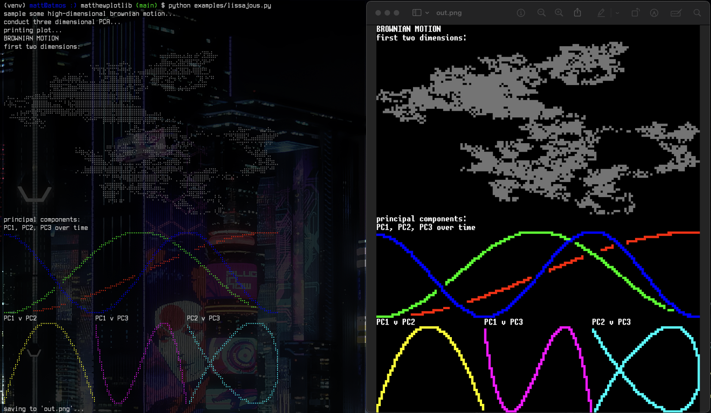

Matthew's plotting library (matthewplotlib)
===========================================

A Python plotting library that isn't painful.

Work in progress.



Contents:

* Image plots
* Scatter plots
* Progress bar
* Text boxes
* Arranging plots
* Various colour maps

TODO:

* axes and labels
* many more plot types
* animated plots
* many more things

Similar:

* https://github.com/tammoippen/plotille
* more...

Installation
------------

Install:

```
pip install git+https://github.com/matomatical/matthewplotlib.git
```

Quickstart
----------

Import:

```
import matthewplotlib as mp
```

TODO: Demos. For now, see the examples folder.
