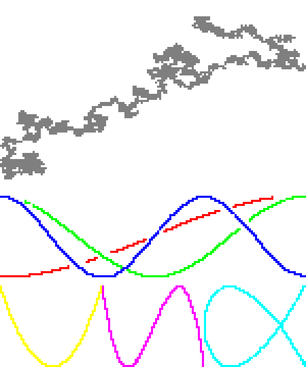
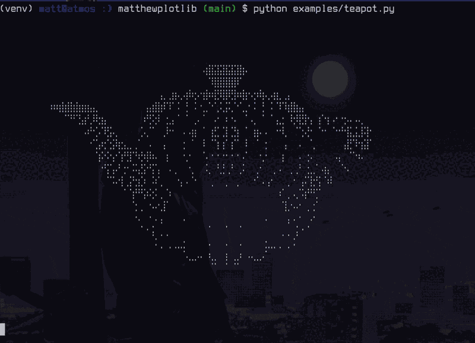
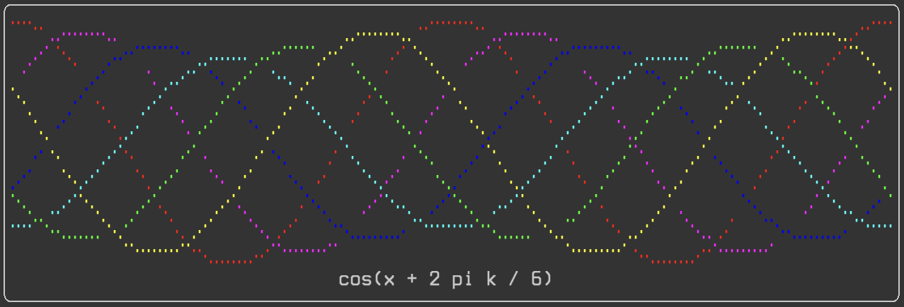
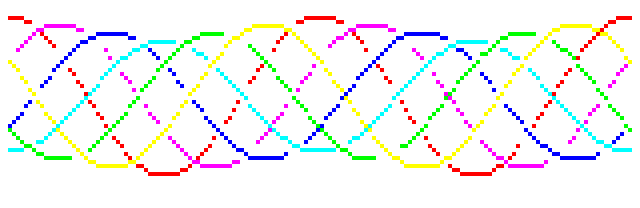

Matthew's plotting library (matthewplotlib)
===========================================

A Python plotting library that aspires to *not be painful.*

*Status:* Work in progress. See [roadmap](#roadmap). Currently, still generally
painful, due to lack of documentation and lack of common plot types. However,
for personal use, I'm already finding its limited functionality delightful.

Key features:

* Colourful unicode-based rendering of scatter plots, small images, heatmaps,
  and more.

* Rendering plots to the terminal with `print(plot)` (no GUI windows to
  manage).

* Plots are just expressions. Compose complex plots with horizontal (`|`) and
  vertical (`^`) stacking operations.

* If you absolutely need plots outside the terminal, you can render them to PNG
  using a pixel font.

Some eye-candy:

<table>
<tbody>
  <tr>
    <td></td>
    <td></td>
  </tr>
</tbody>
</table>

Quickstart
----------

Install:

```console
pip install git+https://github.com/matomatical/matthewplotlib.git
```

Import the library:

```python
import matthewplotlib as mp
```

Construct a plot:
```python
import numpy as np

xs = np.linspace(-2*np.pi, +2*np.pi, 156)
ys1 = 1.0 * np.cos(xs)
ys2 = 0.9 * np.cos(xs - 0.33 * np.pi)
ys3 = 0.8 * np.cos(xs - 0.66 * np.pi)
ys4 = 0.7 * np.cos(xs - 1.00 * np.pi)
ys5 = 0.8 * np.cos(xs - 1.33 * np.pi)
ys6 = 0.9 * np.cos(xs - 1.66 * np.pi)

plot = mp.border(
    mp.scatter(np.c_[xs, ys1], width=78, yrange=(-1,1), color=(1.,0.,0.))
    & mp.scatter(np.c_[xs, ys2], width=78, yrange=(-1,1), color=(1.,0.,1.))
    & mp.scatter(np.c_[xs, ys3], width=78, yrange=(-1,1), color=(0.,0.,1.))
    & mp.scatter(np.c_[xs, ys4], width=78, yrange=(-1,1), color=(0.,1.,1.))
    & mp.scatter(np.c_[xs, ys5], width=78, yrange=(-1,1), color=(0.,1.,0.))
    & mp.scatter(np.c_[xs, ys6], width=78, yrange=(-1,1), color=(1.,1.,0.))
    ^ mp.center(mp.text(f"cos(x + 2 pi k / 6)"), width=78)
)
```

Print to terminal:
```python
print(plot)
```


Export to PNG image:
```python
plot.saveimg("examples/quickstart.png")
```


Other examples
--------------

See [examples/](examples/) folder. Highlights:

* [lissajous.py](examples/lissajous.py) showing scatterplots and basic plot
  arrangement.
* [image.py](examples/image.py) showing heatmaps and some colourmaps.
* [calendar_heatmap.py](examples/calendar_heatmap.py) showing how to construct
  a custom plot, in this case colouring the cells of a calendar.
* [teapot.py](examples/teapot.py) showing how to use scatter plots to render a
  3d point cloud, and animations.

Roadmap
-------

Basic plot types:

* [x] Image plots / matrix heatmaps.
* [x] Function heatmap plots.
* [x] Scatter plots.
* [ ] Coloured scatter plots.
* [x] Hilbert curves.
* [ ] Line plots.
* [x] Progress bars.
* [ ] Bar charts and column charts.
* [ ] Histograms.

Basic plot furnishings:

* [x] Basic text boxes.
* [x] Borders.
* [ ] Ticks and labels (API needs thought).

Basic plot arrangement:

* [x] Horizontal and vertical stacking.
* [x] Naive layering plots on top of each other.
* [x] Automatically wrapping plots into a grid.

Styling plots with colors:

* [x] Basic colormaps.
* [x] BIDS colormaps.
* [x] Rainbow colormap.
* [x] Categorical colour palettes.

Rendering:

* [x] Render to string / terminal with ANSI control codes.
* [x] Export to image with pixel font.

Advanced plot types:

* [ ] Calendar heatmap plots (see calendar heatmap example for now).
* [ ] 3d scatter plots (see teapot example for now).
* [ ] Non-square hilbert curves and 3d hilbert curves.
* [ ] World maps, 2d projection.
* [ ] World maps, 3d globe.

Advanced plot arrangement:

* [ ] Better support for animated plots, including differential rendering.
* [ ] Single scatter plot with multiple point clouds.
* [ ] Single line plot with multiple lines.
* [ ] Clean way to sync config between multiple plots.

Advanced rendering:

* [ ] Export animations to gifs.
* [ ] Render plots to SVG (keep console aesthetic).
* [ ] Render plots to PDF (keep console aesthetic).

Repository:

* [x] Set up project, installable via git.
* [x] A simple example for the quick-start guide.
* [ ] Static site with generated HTML documentation.
* [ ] Version numbering and changelog.
* [ ] List on PyPI.

Other code improvements:

* [ ] Detailed docstrings for everything (at least everything user-facing).
* [ ] Split up monolithic file into a small number of modules.
* [ ] Comprehensive type annotations.
* [ ] Robust input validation.
* [ ] Error handling.
* [ ] Tests.

Example ideas:

* [x] Calendar heatmap (inspired by GitHub daily contributions tracker).
* [x] 3d point clouds.
* [ ] Simple machine learning experiment, loss curves and progress bars.
* [ ] Simple gridworld rollout visualiser for reinforcement learning.
* [ ] CPU/RAM visualiser.

Related work
------------

Terminal plotting in Python

* Plotille: https://github.com/tammoippen/plotille
* Termgraph: https://github.com/sgeisler/termgraph
* Termplot: https://github.com/justnoise/termplot

Braille art

* Drawille (Python): https://github.com/asciimoo/drawille
* Rsille (Rust): https://github.com/nidhoggfgg/rsille
* Drawille (Lua): https://github.com/asciimoo/lua-drawille
* Drawille (NodeJS): https://github.com/madbence/node-drawille
* Python repo documents ports to various other languages

Terminal plotting in other languages

* Julia https://github.com/sunetos/TextPlots.jl
* GNU plot (dumb terminal mode) http://gnuplot.info/docs_6.0/loc19814.html

