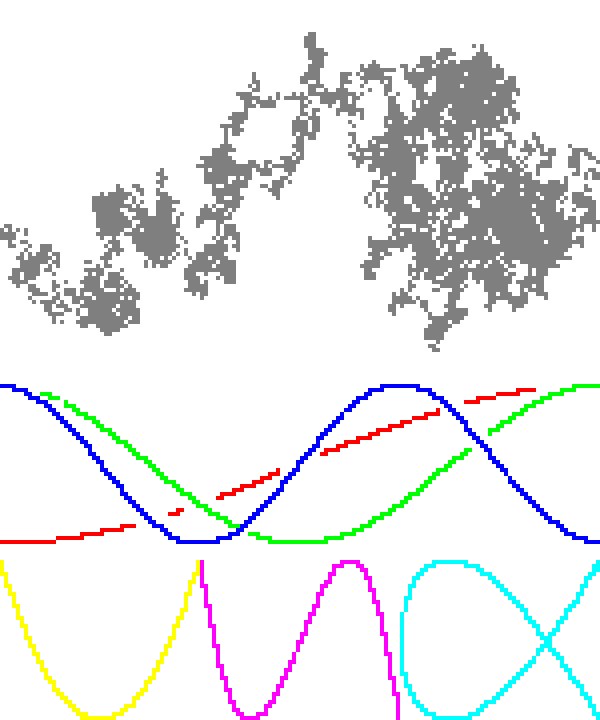
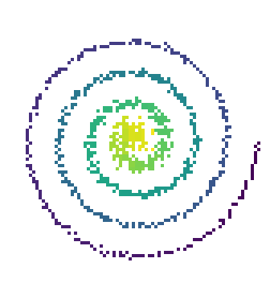
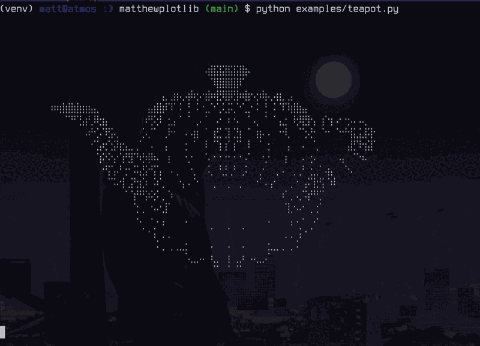
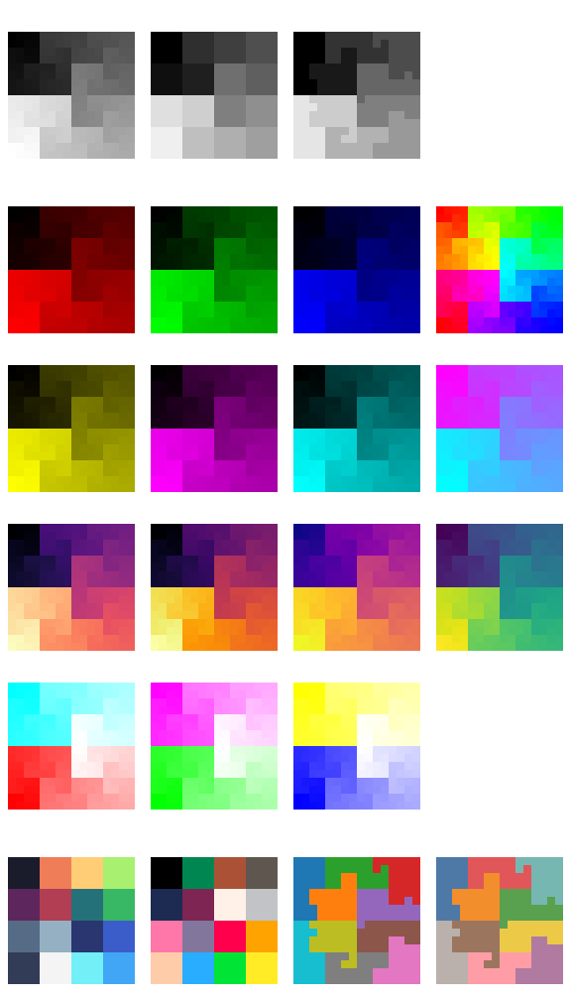

Matthew's plotting library (matthewplotlib)
===========================================

A Python plotting library that aspires to *not be painful.*

*Status:* Work in progress. See [roadmap](https://matthewplotlib.far.in.net/roadmap.html). Currently,
still generally painful, due to lack of generated documentation and lack of
common plot types. However, for personal use, I'm already finding what limited
functionality it does have delightful.

<table><tr>
  <td width="30%">
    
    
  </td>
  <td width="40%">
    
    
  </td>
  <td width="30%">
    
    
  </td>
</tr></table>

Key features:

* Colourful unicode-based rendering of scatter plots, small images, heatmaps,
  bar charts, histograms, 3d plots, and more.
* Rendering plots to the terminal with `print(plot)`. No GUI windows to manage!
* Plots are just expressions. Compose complex plots with horizontal (`+`) and
  vertical (`/`) stacking operations, as in
    `subplots = (plotA + plotB) / (plotC + plotD)`.
* If you absolutely need plots outside the terminal, you can render them to PNG
  using a pixel font.

Rough edges:

* API for compositions not final.
* API for axes not final.
* No labels available for bars/columns/histograms yet.
* Limited [documentation](https://matthewplotlib.far.in.net/).
* Limited input validation, error handling.

Install:

```console
pip install git+https://github.com/matomatical/matthewplotlib.git
```
