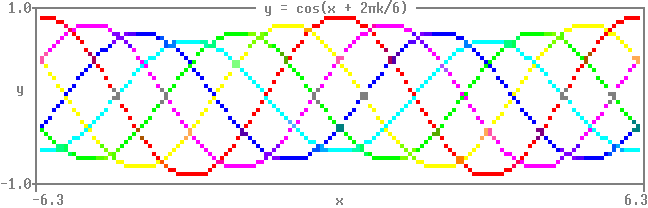

Matthew's plotting library (matthewplotlib)
===========================================

A Python plotting library that aspires to *not be painful.*

*Status:* Work in progress. See [roadmap](#roadmap-to-version-1). Currently,
still generally painful, due to lack of generated documentation and lack of
common plot types. However, for personal use, I'm already finding what limited
functionality it does have delightful.

Key features:

* Colourful unicode-based rendering of scatter plots, small images, heatmaps,
  bar charts, histograms, 3d plots, and more.

* Rendering plots to the terminal with `print(plot)`. No GUI windows to manage!

* Plots are just expressions. Compose complex plots with horizontal (`+`) and
  vertical (`/`) stacking operations, as in
    `subplots = (plotA + plotB) / (plotC + plotD)`.

* If you absolutely need plots outside the terminal, you can render them to PNG
  using a pixel font.

Key missing features (so far, see [roadmap](#roadmap)):

* Line plots still to be implemented.

* Plots don't have visible axes, ticks, ticklabels, or axis labels yet.

* No HTML documentation (but see WIP markdown [DOCS.md](DOCS.md)).

* Not a lot of input validation, error handling, or testing.

Some eye-candy:

<table>
<tbody>
  <tr>
    <td></td>
    <td></td>
    <td></td>
  </tr>
</tbody>
</table>


Quickstart
----------

Install:

```console
pip install git+https://github.com/matomatical/matthewplotlib.git
```

Import the library:

```python
import matthewplotlib as mp
```

Construct a plot:
```python
import numpy as np

xs = np.linspace(-2*np.pi, +2*np.pi, 156)
ys1 = 1.0 * np.cos(xs)
ys2 = 0.9 * np.cos(xs - 0.33 * np.pi)
ys3 = 0.8 * np.cos(xs - 0.66 * np.pi)
ys4 = 0.7 * np.cos(xs - 1.00 * np.pi)
ys5 = 0.8 * np.cos(xs - 1.33 * np.pi)
ys6 = 0.9 * np.cos(xs - 1.66 * np.pi)

kwargs = {'width': 78, 'yrange': (-1,1)}

plot = mp.border(
    mp.scatter(xs, ys1, **kwargs, color=(1.,0.,0.))
    @ mp.scatter(xs, ys2, **kwargs, color=(1.,0.,1.))
    @ mp.scatter(xs, ys3, **kwargs, color=(0.,0.,1.))
    @ mp.scatter(xs, ys4, **kwargs, color=(0.,1.,1.))
    @ mp.scatter(xs, ys5, **kwargs, color=(0.,1.,0.))
    @ mp.scatter(xs, ys6, **kwargs, color=(1.,1.,0.))
    | mp.center(mp.text(f"cos(x + 2 pi k / 6)"), width=78)
)
```

Print to terminal:
```python
print(plot)
```


Export to PNG image:
```python
plot.saveimg("images/quickstart.png")
```



Other examples
--------------

See [examples/](examples/) folder. Highlights:

* [lissajous.py](examples/lissajous.py) showing scatterplots and basic plot
  arrangement.

* [colormaps.py](examples/colormaps.py) showing off the different available
  colormaps more advanced plot arrangement.

* [calendar_heatmap.py](examples/calendar_heatmap.py) showing how to construct
  a custom plot, in this case colouring the cells of a calendar (inspired by
  GitHub issues tracker).

* [teapot.py](examples/teapot.py) showing a 3d scatter plot and animation.

Ideas for future examples:

* Simple machine learning experiment, loss curves and progress bars.

* Simple gridworld rollout visualiser for reinforcement learning.

* CPU/RAM usage visualiser.


Roadmap to version 1
--------------------

Basic plot types:

* [x] Scatter plots.
  * [ ] Different colours for each point.
  * [ ] Multiple point clouds on a single scatter plot.
* [x] Function scatter plots.
* [ ] Line plots (connect the dots).
* [x] Image plots / matrix heatmaps.
* [x] Function heatmap plots.
* [x] Progress bars.
* [x] Basic bar charts and column charts.
* [x] Histograms.

Basic plot furnishings:

* [x] Basic text boxes.
* [x] Borders.
* [ ] Axis ticks and tick labels for scatter plots.
* [ ] Labels and ticks for bar/column charts and histograms.

Basic plot arrangement:

* [x] Horizontal and vertical stacking.
* [x] Naive layering plots on top of each other.
* [x] Automatically wrapping plots into a grid.

Styling plots with colors:

* [ ] Consistent API for color specification.
* [x] Basic colormaps.
* [x] BIDS colormaps.
* [x] Rainbow colormap.
* [x] Cyberpunk colormap.
* [x] Discrete colour palettes.

Rendering:

* [x] Render to string / terminal with ANSI control codes.
* [x] Export to image with pixel font.

Basic code improvements:

* [x] Split up monolithic file into a small number of modules.
* [ ] Split up plotting module with one file per plot type.
* [x] Comprehensive type annotations, static type checking with mypy.
* [ ] Robust input validation and error handling.
* [ ] Tests.

Documentation:

* [x] Minimal docstrings for everything user-facing.
* [x] Quick start guide.
* [x] Complete docstrings for modules, constants, etc.
* [x] Simple generated markdown documentation on GitHub.
* [ ] Simple generated HTML/CSS documentation, hosted on web.

Repository:

* [x] Set up project, installable via git.
* [x] A simple example for the quick-start guide.
* [x] Changelog.
* [x] Version numbering and keep main branch working.
* [ ] List on PyPI.

Advanced features roadmap
-------------------------

More plot types:

* Advanced scatter plots:
  * [x] 3d scatter plots.
* Advanced line plots:
  * [ ] Error bars on line plots.
  * [ ] Fill plots.
* Advanced bar charts:
  * [x] Bar/column charts with configurable sizes and spacing.
  * [ ] Bar/column charts with other alignments.
  * [ ] Negative values in bar/column charts.
* Hilbert curves:
  * [x] Basic Hilbert curves.
  * [ ] Non-square Hilbert curves.
  * [ ] 3d Hilbert curves.
* World maps:
  * [ ] Some 2d projections.
  * [ ] 3d globe projection.
* Other:
  * [ ] Calendar heatmap plots (see calendar heatmap example for now).
  * [ ] Candlestick plots.
  * [ ] Box plots.

Advanced plot arrangement:

* [ ] Better support for animated plots (API needs thought).
* [ ] Cleaner way to share config/axes between multiple plots.

Advanced furnishings:

* [ ] Axis transformations (e.g. logarithmic scale).
* [ ] Legend construction (API needs thought).
* [ ] Color bars, vertical or horizontal.
* [ ] Text embedded in borders.

Advanced rendering:

* [x] Export animations to gifs.
* [ ] Render plots to SVG (keep console aesthetic).
* [ ] Render plots to PDF (keep console aesthetic).

Back end improvements:

* [x] Upgrade Char backend to use arrays of codepoints and colors.
* [x] Vectorised composition operations.
* [x] Vectorised bitmap rendering.
* [x] Intelligent ANSI rendering (only include necessary control codes and
  resets, e.g., if several characters in a row use the same colours).
* [ ] Faster animated plot redraws (e.g., differential rendering with shortcut
  `-`).
* [ ] Clean up backend code e.g. using JAX PyTrees and vectorisation.

More elaborate documentation:

* [ ] Tutorials and recipes.
* [ ] Freeze documentation with each version.
* [x] Links to source code from within documentation.
* [ ] Links to mentioned functions/classes/methods/types within documentation
  (automatically linked to relevant release).
* [ ] Documentation search.

Future design directions.

* [ ] Reactive plots.

Related work
------------

Matthewplotlib aspires to achieve a similar levels of functionality as covered
by the following projects.

Terminal plotting in Python:

* Plotext: https://github.com/piccolomo/plotext
* Plotille: https://github.com/tammoippen/plotille
* Termgraph: https://github.com/sgeisler/termgraph
* Termplot: https://github.com/justnoise/termplot

Terminal plotting in other languages:

* Julia https://github.com/JuliaPlots/UnicodePlots.jl
* Julia again https://github.com/sunetos/TextPlots.jl
* C++ https://github.com/fbbdev/plot
* GNU plot (dumb terminal mode) http://gnuplot.info/docs_6.0/loc19814.html

Braille art:

* Drawille (Python): https://github.com/asciimoo/drawille
* Rsille (Rust): https://github.com/nidhoggfgg/rsille
* Drawille (Lua): https://github.com/asciimoo/lua-drawille
* Drawille (NodeJS): https://github.com/madbence/node-drawille
* Python repo documents ports to various other languages

TODO: Checklist of specific interesting target features that are and are not
implemented.

Other Python plotting libraries, most of which offer some level of
interactivity that there are no plans to replicate.

* Matplotlib https://github.com/matplotlib/matplotlib
* Seaborn https://github.com/mwaskom/seaborn
* Plotly.py https://github.com/plotly/plotly.py
* Pygal https://github.com/Kozea/pygal
* Bokeh https://github.com/bokeh/bokeh
* Altair https://github.com/vega/altair
  * Declarative API
