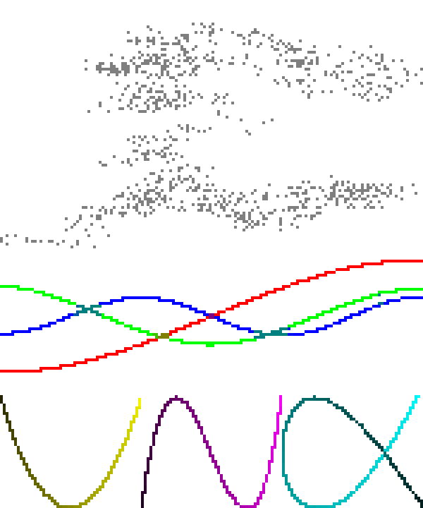

Matthew's plotting library (matthewplotlib)
===========================================

A Python plotting library that aspires to *not be painful.*

*Status:* Work in progress. See [roadmap](#roadmap-to-version-1). Currently,
still generally painful, due to lack of generated documentation and lack of
common plot types. However, for personal use, I'm already finding what limited
functionality it does have delightful.

Key features:

* Colourful unicode-based rendering of scatter plots, small images, heatmaps,
  and more.

* Rendering plots to the terminal with `print(plot)` (no GUI windows to
  manage).

* Plots are just expressions. Compose complex plots with horizontal (`|`) and
  vertical (`^`) stacking operations, as in
    `subplots = (plotA | plotB) ^ (plotC | plotD)`.

* If you absolutely need plots outside the terminal, you can render them to PNG
  using a pixel font.

Key missing features (so far, see [roadmap]):

* Line plots, bar charts, histograms still to be implemented.

* Scatter plots don't have visible axes, ticks, ticklabels, or axis labels yet.

* No HTML documentation.

* Not a lot of input validation, error handling, or testing.

Some eye-candy:

<table>
<tbody>
  <tr>
    <td></td>
    <td></td>
    <td></td>
  </tr>
</tbody>
</table>

Quickstart
----------

Install:

```console
pip install git+https://github.com/matomatical/matthewplotlib.git
```

Import the library:

```python
import matthewplotlib as mp
```

Construct a plot:
```python
import numpy as np

xs = np.linspace(-2*np.pi, +2*np.pi, 156)
ys1 = 1.0 * np.cos(xs)
ys2 = 0.9 * np.cos(xs - 0.33 * np.pi)
ys3 = 0.8 * np.cos(xs - 0.66 * np.pi)
ys4 = 0.7 * np.cos(xs - 1.00 * np.pi)
ys5 = 0.8 * np.cos(xs - 1.33 * np.pi)
ys6 = 0.9 * np.cos(xs - 1.66 * np.pi)

plot = mp.border(
    mp.scatter(np.c_[xs, ys1], width=78, yrange=(-1,1), color=(1.,0.,0.))
    & mp.scatter(np.c_[xs, ys2], width=78, yrange=(-1,1), color=(1.,0.,1.))
    & mp.scatter(np.c_[xs, ys3], width=78, yrange=(-1,1), color=(0.,0.,1.))
    & mp.scatter(np.c_[xs, ys4], width=78, yrange=(-1,1), color=(0.,1.,1.))
    & mp.scatter(np.c_[xs, ys5], width=78, yrange=(-1,1), color=(0.,1.,0.))
    & mp.scatter(np.c_[xs, ys6], width=78, yrange=(-1,1), color=(1.,1.,0.))
    ^ mp.center(mp.text(f"cos(x + 2 pi k / 6)"), width=78)
)
```

Print to terminal:
```python
print(plot)
```


Export to PNG image:
```python
plot.saveimg("images/quickstart.png")
```


Other examples
--------------

See [examples/](examples/) folder. Highlights:

* [lissajous.py](examples/lissajous.py) showing scatterplots and basic plot
  arrangement.

* [colormaps.py](examples/colormaps.py) showing off the different available
  colormaps more advanced plot arrangement.

* [calendar_heatmap.py](examples/calendar_heatmap.py) showing how to construct
  a custom plot, in this case colouring the cells of a calendar (inspired by
  GitHub issues tracker).

* [teapot.py](examples/teapot.py) showing how to use scatter plots to render a
  3d point cloud, and animations.

Ideas for future examples:

* Simple machine learning experiment, loss curves and progress bars.

* Simple gridworld rollout visualiser for reinforcement learning.

* CPU/RAM usage visualiser.


Roadmap to version 1
--------------------

Basic plot types:

* [x] Image plots / matrix heatmaps.
* [x] Function heatmap plots.
* [x] Scatter plots.
* [x] Hilbert curves.
* [ ] Line plots.
* [x] Progress bars.
* [ ] Bar charts and column charts.
* [ ] Histograms.

Basic plot furnishings:

* [x] Basic text boxes.
* [x] Borders.
* [ ] Axis ticks and tick labels for scatter plots (API needs some thought).

Basic plot arrangement:

* [x] Horizontal and vertical stacking.
* [x] Naive layering plots on top of each other.
* [x] Automatically wrapping plots into a grid.

Styling plots with colors:

* [x] Basic colormaps.
* [x] BIDS colormaps.
* [x] Rainbow colormap.
* [x] Cyberpunk colormap.
* [x] Discrete colour palettes.

Rendering:

* [x] Render to string / terminal with ANSI control codes.
* [x] Export to image with pixel font.

Basic code improvements:

* [x] Detailed docstrings for everything user-facing.
* [x] Split up monolithic file into a small number of modules.
* [x] Comprehensive type annotations, static type checking with mypy.
* [ ] Robust input validation and error handling.
* [ ] Tests.

Repository:

* [x] Set up project, installable via git.
* [x] A simple example for the quick-start guide.
* [x] Version numbering and changelog.
* [ ] Static site with generated HTML documentation.
* [ ] List on PyPI.


Advanced features roadmap
-------------------------

More plot types:

* [ ] Scatter plots with different colours.
* [ ] Less dense (non-braille) scatter plots with different markers.
* [ ] Multiple point clouds or lines on a single scatter/line plot.
* [ ] 3d scatter plots (see [teapot example](examples/teapot.py) for now).
* [ ] Non-square hilbert curves and 3d hilbert curves.
* [ ] Calendar heatmap plots (see calendar heatmap example for now).
* [ ] World maps, 2d projection.
* [ ] World maps, 3d globe.

Advanced plot arrangement:

* [ ] Better support for animated plots (API needs thought).
* [ ] Cleaner way to share config/axes between multiple plots.

Advanced rendering:

* [ ] Export animations to gifs.
* [ ] Render plots to SVG (keep console aesthetic).
* [ ] Render plots to PDF (keep console aesthetic).

Backend improvements:

* [ ] Upgrade Char backend to use arrays of codepoints and colors (think
  PyTrees from JAX to replace the current nested lists of dataclasses).
* [ ] Vectorised composition operations.
* [ ] Vectorised bitmap rendering.
* [ ] Faster and more intelligent ANSI rendering (only include necessary
  control codes and resets, e.g., if several characters in a row use the same
  colours).
* [ ] Faster animated plot redraws (e.g., differential rendering with shortcut
  `-`).


Related work
------------

Terminal plotting in Python

* Plotille: https://github.com/tammoippen/plotille
* Termgraph: https://github.com/sgeisler/termgraph
* Termplot: https://github.com/justnoise/termplot

Braille art

* Drawille (Python): https://github.com/asciimoo/drawille
* Rsille (Rust): https://github.com/nidhoggfgg/rsille
* Drawille (Lua): https://github.com/asciimoo/lua-drawille
* Drawille (NodeJS): https://github.com/madbence/node-drawille
* Python repo documents ports to various other languages

Terminal plotting in other languages

* Julia https://github.com/sunetos/TextPlots.jl
* GNU plot (dumb terminal mode) http://gnuplot.info/docs_6.0/loc19814.html

