Examples
========

> [!NOTE] Do you have a cool, standalone matthewplotlib example?
> 
> I'd love to include it on this page! Please send me a link.

Contents:

* [Series Data Visualisation](#series-data-visualisation)
* [Surface Data Visualisation](#surface-data-visualisation)
* [Nonlinear Visualisation](#nonlinear-visualisation)
* [Bars and Columns](#bars-and-columns)
* [Media](#media)
* [Retro Animations](#retro-animations)
* [Simulations](#simulations)
* [Dashboards and UI](#dashboards-and-ui)
* [Utilities](#utilities)

See the [examples/](https://github.com/matomatical/matthewplotlib/tree/main/examples)
folder for source code.

Series Data Visualisation
-------------------------

<table>
<thead>
  <th width="50%">Image</th>
  <th width="50%">Example</th>
</thead>
<tbody>
  <tr>
    <td align="center">
      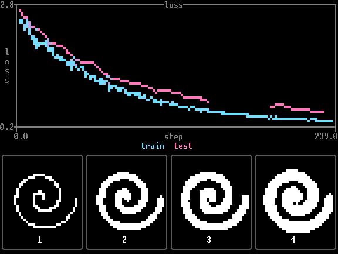
    </td>
    <td>
      
<strong>Line charts</strong>

      
Line plot test, including series with missing values (NaN).

      
<em>By Claude Opus 5.</em>

      
<a href="https://github.com/matomatical/matthewplotlib/blob/main/examples/lines.py">Source</a>

    </td>
  </tr>
  <tr>
    <td align="center">
      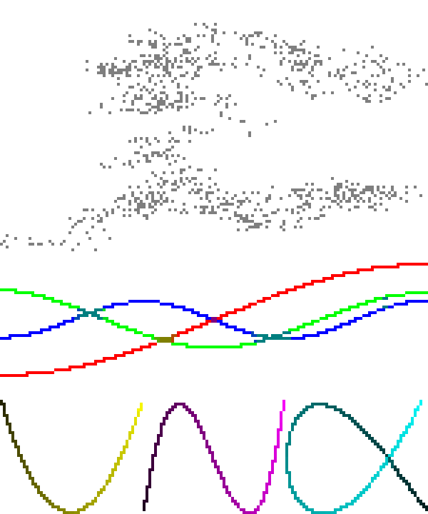
    </td>
    <td>
      
<strong>Lissajous curves</strong>

      
Brownian motion PCA visualisation with scatterplots and plot
      arrangement.

      
<em>By Matthew Farrugia-Roberts.</em>

      
<a href="https://github.com/matomatical/matthewplotlib/blob/main/examples/lissajous.py">Source</a>

    </td>
  </tr>
  <tr>
    <td align="center">
      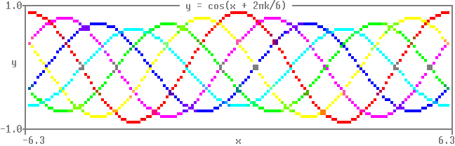
    </td>
    <td>
      
<strong>Quickstart 1</strong>

      
Coloured cosine waves with phase offsets.

      
<em>By Matthew Farrugia-Roberts.</em>

      
<a href="https://github.com/matomatical/matthewplotlib/blob/main/examples/quickstart1.py">Source</a>

    </td>
  </tr>
  <tr>
    <td align="center">
      
    </td>
    <td>
      
<strong>Quickstart 2</strong>

      
Animated cosine wave with shifting phase and amplitude, as a loop of
      <code>print(plot - prev)</code>.

      
<em>By Matthew Farrugia-Roberts.</em>

      
<a href="https://github.com/matomatical/matthewplotlib/blob/main/examples/quickstart2.py">Source</a>

    </td>
  </tr>
  <tr>
    <td align="center">
      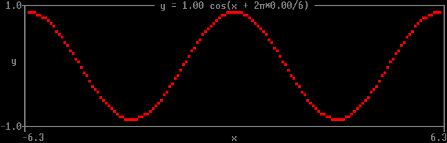
    </td>
    <td>
      
<strong>Quickstart 3</strong>

      
The same animation with the loop handed to <code>mp.animate</code>,
      which keeps the previous frame and the frame clock.

      
<em>By Claude Opus 5.</em>

      
<a href="https://github.com/matomatical/matthewplotlib/blob/main/examples/quickstart3.py">Source</a>

    </td>
  </tr>
  <tr>
    <td align="center">
      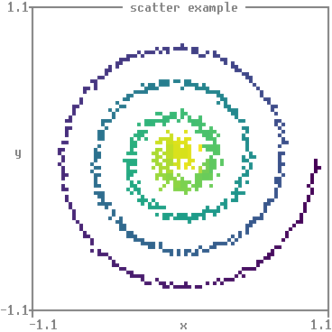
    </td>
    <td>
      
<strong>Scatter</strong>

      
Spiral scatter plot with viridis colormap.

      
<em>By Matthew Farrugia-Roberts.</em>

      
<a href="https://github.com/matomatical/matthewplotlib/blob/main/examples/scatter.py">Source</a>

    </td>
  </tr>
  <tr>
    <td align="center">
      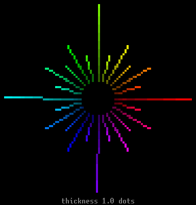
    </td>
    <td>
      
<strong>Starburst</strong>

      
Line plot colour and thickness test.

      
<em>By Claude Opus 5.</em>

      
<a href="https://github.com/matomatical/matthewplotlib/blob/main/examples/starburst.py">Source</a>

    </td>
  </tr>
  <tr>
    <td align="center">
      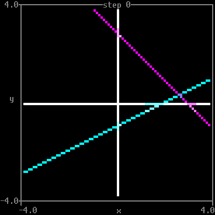
    </td>
    <td>
      
<strong>Teacher-student regression</strong>

      
Gradient descent on a simple teacher-student linear regression
      model.

      
<em>By Matthew Farrugia-Roberts.</em>

      
<a href="https://github.com/matomatical/matthewplotlib/blob/main/examples/teacher_student.py">Source</a>

    </td>
  </tr>
</tbody>
</table>

Surface Data Visualisation
--------------------------

<table>
<thead>
  <th width="50%">Image</th>
  <th width="50%">Example</th>
</thead>
<tbody>
  <tr>
    <td align="center">
      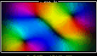
    </td>
    <td>
      
<strong>Chromatic flow</strong>

      
A moving incompressible velocity field, with hue showing direction
      and brightness showing speed. Its custom colormap consumes two-component
      vectors directly.

      
<em>By GPT 5.6 Sol.</em>

      
<a href="https://github.com/matomatical/matthewplotlib/blob/main/examples/chromatic_flow.py">Source</a>

    </td>
  </tr>
  <tr>
    <td align="center">
      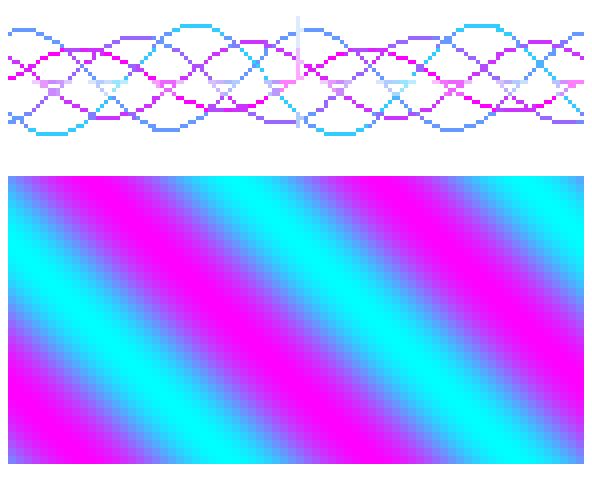
    </td>
    <td>
      
<strong>Functions</strong>

      
Mathematical function visualisation with scatter and function2.

      
<em>By Matthew Farrugia-Roberts.</em>

      
<a href="https://github.com/matomatical/matthewplotlib/blob/main/examples/functions.py">Source</a>

    </td>
  </tr>
  <tr>
    <td align="center">
      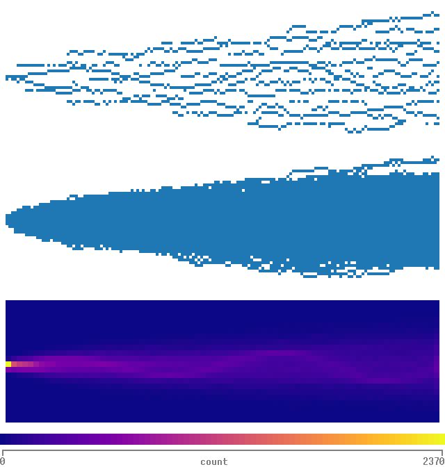
    </td>
    <td>
      
<strong>Time series histogram</strong>

      
Time series visualisation with stacked scatter, pooled scatter, and 2D
      histogram.

      
<em>By Matthew Farrugia-Roberts.</em>

      
<a href="https://github.com/matomatical/matthewplotlib/blob/main/examples/time_series_histogram.py">Source</a>

    </td>
  </tr>
  <tr>
    <td align="center">
      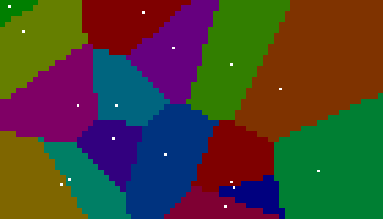
    </td>
    <td>
      
<strong>Voronoi diagram</strong>

      
Voronoi diagram using function heatmaps and scipy.

      
<em>By Gemini 2.5 Pro.</em>

      
<a href="https://github.com/matomatical/matthewplotlib/blob/main/examples/voronoi.py">Source</a>

    </td>
  </tr>
</tbody>
</table>

Nonlinear Visualisation
-----------------------

<table>
<thead>
  <th width="50%">Image</th>
  <th width="50%">Example</th>
</thead>
<tbody>
  <tr>
    <td align="center">
      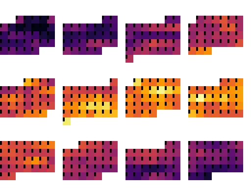
    </td>
    <td>
      
<strong>Calendar heatmap</strong>

      
Calendar heatmap of daily maximum temperatures in Oxford, 2025.

      
<em>By Matthew Farrugia-Roberts and Claude Opus 4.6.</em>

      
<a href="https://github.com/matomatical/matthewplotlib/blob/main/examples/calendar_heatmap.py">Source</a>

    </td>
  </tr>
  <tr>
    <td align="center">
      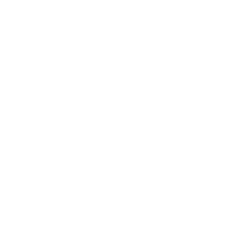
    </td>
    <td>
      
<strong>Hilbert curve</strong>

      
Hilbert curve visualisation of binomial data.

      
<em>By Matthew Farrugia-Roberts.</em>

      
<a href="https://github.com/matomatical/matthewplotlib/blob/main/examples/hilbert_curve.py">Source</a>

    </td>
  </tr>
</tbody>
</table>

Bars and Columns
----------------

<table>
<thead>
  <th width="50%">Image</th>
  <th width="50%">Example</th>
</thead>
<tbody>
  <tr>
    <td align="center">
      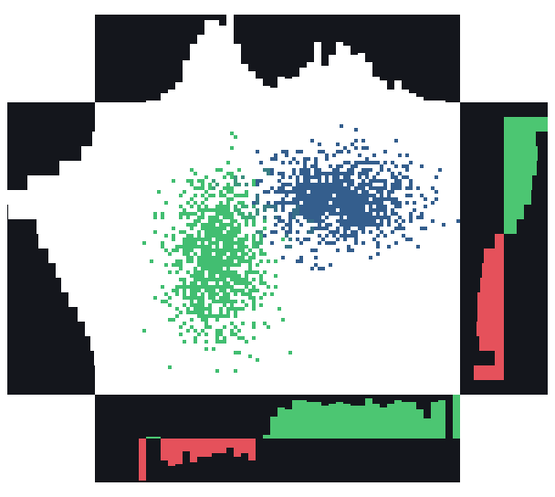
    </td>
    <td>
      
<strong>Joint distribution</strong>

      
Joint distribution with marginal histograms, demonstrating plot
      composition with hstack and vstack.

      
<em>By Claude Opus 4.6.</em>

      
<a href="https://github.com/matomatical/matthewplotlib/blob/main/examples/jointplot.py">Source</a>

    </td>
  </tr>
  <tr>
    <td align="center">
      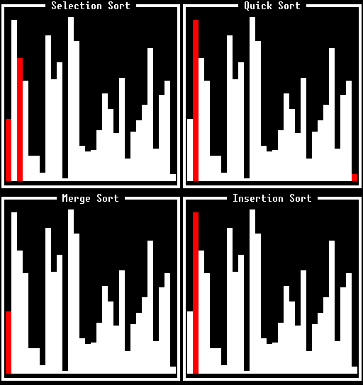
    </td>
    <td>
      
<strong>Sorting algorithms</strong>

      
Various sorting algorithms racing in parallel, visualised with <code>mp.columns</code> and <code>mp.wrap</code>.

      
<em>By Gemini 3.1 Pro.</em>

      
<a href="https://github.com/matomatical/matthewplotlib/blob/main/examples/sorting.py">Source</a>

    </td>
  </tr>
</tbody>
</table>

Media
-----

<table>
<thead>
  <th width="50%">Image</th>
  <th width="50%">Example</th>
</thead>
<tbody>
  <tr>
    <td align="center">
      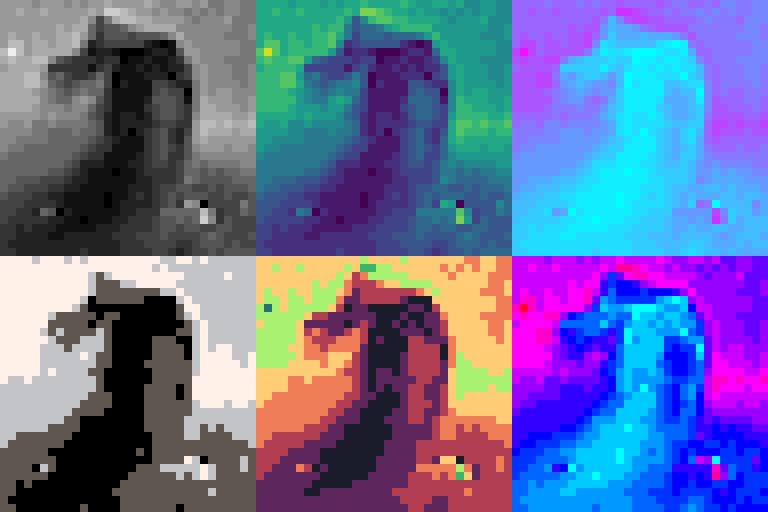
    </td>
    <td>
      
<strong>Image rendering</strong>

      
Image rendering with various colormaps.

      
<em>By Matthew Farrugia-Roberts.</em>

      
<a href="https://github.com/matomatical/matthewplotlib/blob/main/examples/image.py">Source</a>

    </td>
  </tr>
</tbody>
</table>

Retro Animations
----------------

<table>
<thead>
  <th width="50%">Image</th>
  <th width="50%">Example</th>
</thead>
<tbody>
  <tr>
    <td align="center">
      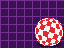
    </td>
    <td>
      
<strong>Boing</strong>

      
The Amiga Boing Ball, 1984, animated using a rotating colour
      palette.

      
<em>By Claude Opus 5.</em>

      
<a href="https://github.com/matomatical/matthewplotlib/blob/main/examples/boing.py">Source</a>

    </td>
  </tr>
  <tr>
    <td align="center">
      
    </td>
    <td>
      
<strong>Doom fire</strong>

      
The classic 1997 PSX Doom fire effect mapped through a custom palette using <code>mp.image</code>.

      
<em>By Gemini 3.1 Pro.</em>

      
<a href="https://github.com/matomatical/matthewplotlib/blob/main/examples/doomfire.py">Source</a>

    </td>
  </tr>
  <tr>
    <td align="center">
      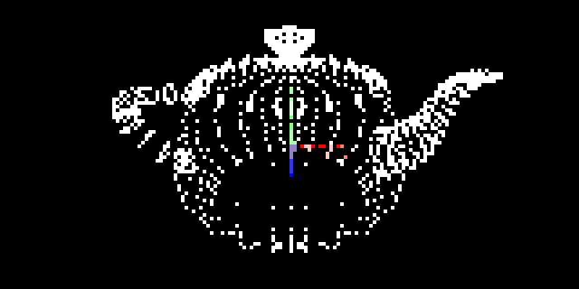
    </td>
    <td>
      
<strong>Teapot</strong>

      
3D scatter plot with animated camera orbit.

      
<em>By Matthew Farrugia-Roberts.</em>

      
<a href="https://github.com/matomatical/matthewplotlib/blob/main/examples/teapot.py">Source</a>

    </td>
  </tr>
  <tr>
    <td align="center">
      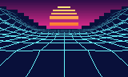
    </td>
    <td>
      
<strong>Vaporwave</strong>

      
A wireframe landscape scrolling under a banded sun. The backdrop of
      sky, ground and sun is an image of half-blocks; the terrain is one
      <code>mp.line3</code> over the top of it.

      
<em>By Matthew Farrugia-Roberts and Claude Opus 5.</em>

      
<a href="https://github.com/matomatical/matthewplotlib/blob/main/examples/vaporwave.py">Source</a>

    </td>
  </tr>
</tbody>
</table>

Simulations
-----------

<table>
<thead>
  <th width="50%">Image</th>
  <th width="50%">Example</th>
</thead>
<tbody>
  <tr>
    <td align="center">
      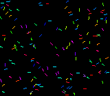
    </td>
    <td>
      
<strong>Boids</strong>

      

      Boids Flocking Simulation. Simulates autonomous agents (boids) moving in
      2D space based on simple rules.
      

      
<em>By Gemini 3.1 Pro.</em>

      
<a href="https://github.com/matomatical/matthewplotlib/blob/main/examples/boids.py">Source</a>

    </td>
  </tr>
  <tr>
    <td align="center">
      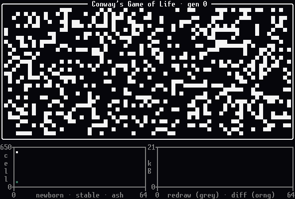
    </td>
    <td>
      
<strong>Life</strong>

      
Conway's Game of Life with extra colours for newly alive/dead cells.
      The panels underneath track the cell counts and, on the right, number of
      terminal bytes written using different rendering methods.

      
<em>By Claude Opus 5.</em>

      
<a href="https://github.com/matomatical/matthewplotlib/blob/main/examples/life.py">Source</a>

    </td>
  </tr>
  <tr>
    <td align="center">
      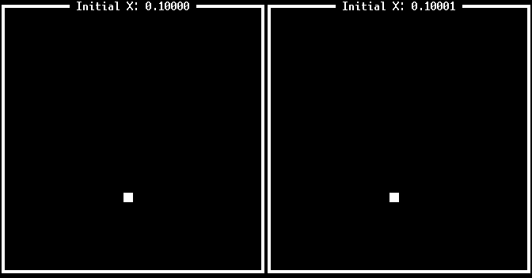
    </td>
    <td>
      
<strong>Lorenz attractor</strong>

      
Animated 3D Lorenz attractors showing sensitive dependence on initial conditions.

      
<em>By Gemini 3.1 Pro.</em>

      
<a href="https://github.com/matomatical/matthewplotlib/blob/main/examples/lorenz.py">Source</a>

    </td>
  </tr>
  <tr>
    <td align="center">
      
    </td>
    <td>
      
<strong>Mandelbrot</strong>

      
Animated Mandelbrot fractal zoom using function heatmaps and
      colormaps.

      
<em>By Gemini 2.5 Pro.</em>

      
<a href="https://github.com/matomatical/matthewplotlib/blob/main/examples/mandelbrot.py">Source</a>

    </td>
  </tr>
  <tr>
    <td align="center">
      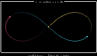
    </td>
    <td>
      
<strong>Three bodies</strong>

      
Three equal masses chasing one another around a shared figure-eight
      orbit, integrated under Newtonian gravity.

      
<em>By GPT 5.6 Sol.</em>

      
<a href="https://github.com/matomatical/matthewplotlib/blob/main/examples/three_body.py">Source</a>

    </td>
  </tr>
</tbody>
</table>

Dashboards and UI
-----------------

<table>
<thead>
  <th width="50%">Image</th>
  <th width="50%">Example</th>
</thead>
<tbody>
  <tr>
    <td align="center">
      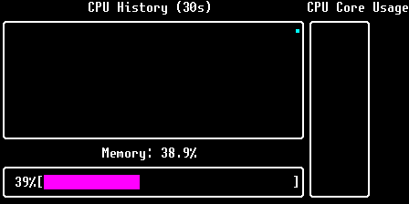
    </td>
    <td>
      
<strong>Dashboard</strong>

      
Live system monitoring dashboard showing CPU and memory usage.

      
<em>By Gemini 2.5 Pro.</em>

      
<a href="https://github.com/matomatical/matthewplotlib/blob/main/examples/dashboard.py">Source</a>

    </td>
  </tr>
</tbody>
</table>

Utilities
---------

<table>
<thead>
  <th width="50%">Image</th>
  <th width="50%">Example</th>
</thead>
<tbody>
  <tr>
    <td align="center">
      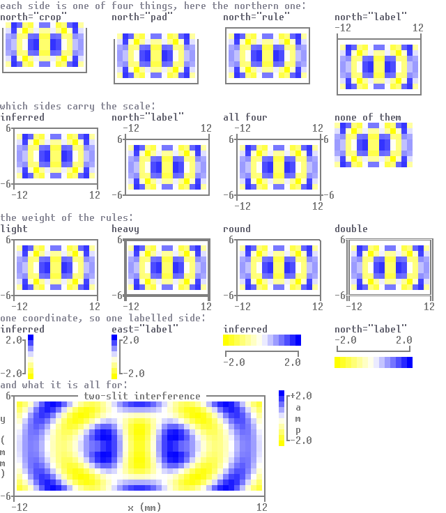
    </td>
    <td>
      
<strong>Axes gallery</strong>

      
Every way of drawing an axis, around one two-slit interference
      pattern: what each side can be, which sides carry the scale, the weight
      of the rules, and how a quantity with a single coordinate is labelled.

      
<em>By Claude Opus 5.</em>

      
<a href="https://github.com/matomatical/matthewplotlib/blob/main/examples/axes_gallery.py">Source</a>

    </td>
  </tr>
  <tr>
    <td align="center">
      
    </td>
    <td>
      
<strong>Colormaps</strong>

      
Gallery of all available continuous and discrete colormaps.

      
<em>By Matthew Farrugia-Roberts.</em>

      
<a href="https://github.com/matomatical/matthewplotlib/blob/main/examples/colormaps.py">Source</a>

    </td>
  </tr>
  <tr>
    <td align="center">
      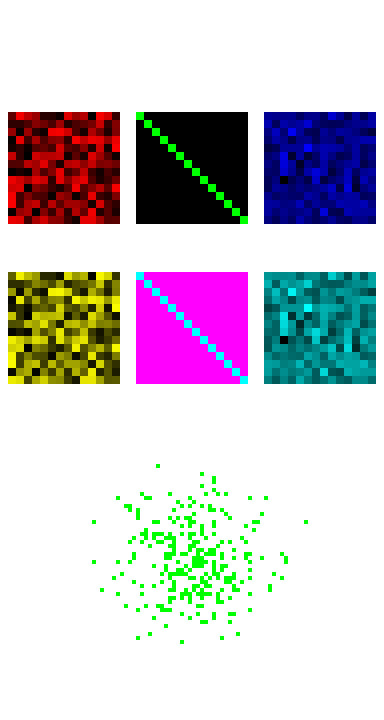
    </td>
    <td>
      
<strong>Demo</strong>

      
Original library example combining images, borders, and scatter plots.

      
<em>By Matthew Farrugia-Roberts.</em>

      
<a href="https://github.com/matomatical/matthewplotlib/blob/main/examples/demo.py">Source</a>

    </td>
  </tr>
  <tr>
    <td align="center">
      Run <code>python examples/terminal_test.py</code>
    </td>
    <td>
      
<strong>Terminal test</strong>

      
Does your terminal render matthewplotlib correctly? Test of escape
      sequences for colour, redrawing in place, resizing, and a plot pushed
      against the right margin.

      
See also <a href="compatibility.html">compatibility</a>.

      
<em>By Claude Opus 5.</em>

      
<a href="https://github.com/matomatical/matthewplotlib/blob/main/examples/terminal_test.py">Source</a>

    </td>
  </tr>
</tbody>
</table>
